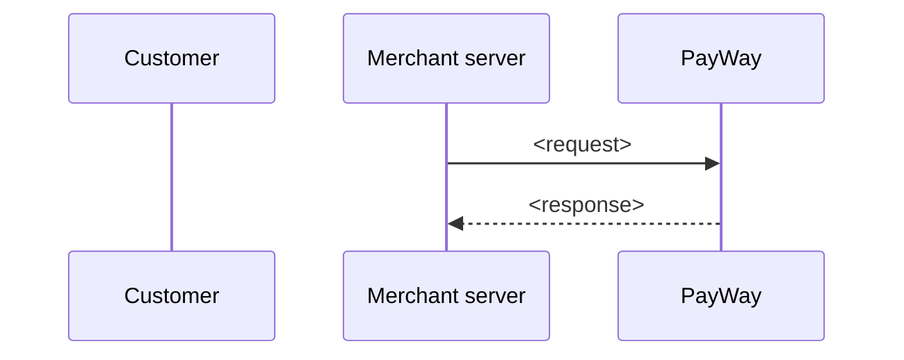

# PayWay Integration Skill & Knowledge Base Implementation Plan

> **For agentic workers:** REQUIRED SUB-SKILL: Use superpowers:subagent-driven-development (recommended) or superpowers:executing-plans to implement this plan task-by-task. Steps use checkbox (`- [ ]`) syntax for tracking.

**Goal:** Build one repo containing (a) a team-editable PayWay knowledge base published as a VitePress site with raw `.md` + `llms.txt` for agents, and (b) a thin `payway-integration` agent skill that fetches that knowledge on demand.

**Architecture:** Markdown in `docs/` is the single source. Small Node scripts in `scripts/lib/` load pages, validate them (`check`), and emit agent files (raw `.md`, `llms.txt`, drafts list) from VitePress's `buildEnd` hook. The skill (`skills/payway-integration/SKILL.md`) contains workflow and fetch rules only; the repo root is also a Claude Code plugin/marketplace exposing five commands.

**Tech Stack:** Node 22+ (ESM, `node:test`), VitePress 1.x, gray-matter, Python 3.10+ (`unittest`) for the Python example, GitHub Actions + GitHub Pages.

**Spec:** `design/2026-10-05-payway-integration-skill-design.md`

### Spec deviations (decided while planning — flag to reviewer)

1. **Commands live at repo root `commands/`**, not `skills/payway-integration/commands/`. Claude Code plugins load commands only from the plugin root.
2. **No hash signing in `web` (browser) examples.** The spec's testing section says "Node, Python, and JS hash-signing". Signing in the browser would expose the API key, so web examples only render a form with a hash the server already computed. Test vectors cover Node and Python.
3. **Code examples live in real source files** (`docs/examples/<lang>/*.mjs|.py|.html`) that the `.md` pages include with VitePress `<<< @/path`. This makes them executable in CI. The agent `.md` copies inline the file contents.
4. **Templates live in `templates/`** (repo root, unpublished) so editors can copy them in the GitHub web UI.

## Global Constraints

- Editors never need local tooling: every check runs in GitHub Actions; publishing = merge to `main`.
- Content is English only.
- Launch example languages: `node`, `python`, `web` — exactly these values in `language:` frontmatter.
- Page `type` is exactly one of: `guide`, `service`, `api`, `example`, `best-practice`.
- `status` is exactly `draft` or `verified`; `verified` requires `verified_by` and `verified_on` (YYYY-MM-DD).
- Required frontmatter on every page: `id`, `type`, `title`, `summary`, `status`.
- Required `##` sections (in order) — api: Endpoint, Authentication & hash, Request fields, Response, Errors, Pitfalls; service: When to use, When not to use, Flow, APIs involved, Sandbox testing, Examples, Best practices; example: Prerequisites, Code, How to run.
- Docs base URL: env `DOCS_BASE_URL`, default `https://payway-ai.payway.com.kh` (final domain is an open item).
- Never rename a file under `docs/` once merged (URLs derive from paths).
- Nothing internal/secret goes under `docs/` — it is published publicly.
- Secrets in examples are read from env vars `PAYWAY_MERCHANT_ID`, `PAYWAY_API_KEY`; never hard-coded, never sent to the browser.
- All AI-drafted pages ship with `status: draft`.

## Review Focus

1. **Windows CRLF line endings** (Git already warned about CRLF on this machine) — headings and frontmatter must still be detected; a CRLF page must pass the check exactly like an LF page. → test in Task 1.
2. **Malformed or missing frontmatter** — the check must print a readable `file: problem` line, never crash with a stack trace. → test in Task 2.
3. **Links with anchors, `.md` suffixes, relative `../` paths, and `index` pages** — valid ones must pass, broken ones must be named. → tests in Task 2.
4. **Non-ASCII (Khmer) text in hashed fields** — signatures must be computed over UTF-8 bytes identically in Node and Python. → Khmer vector in Task 5.
5. **`<<<` snippet include pointing at a missing file** — check must fail with the file name, not produce an agent `.md` silently missing its code. → test in Task 2 and Task 3.

---

## File Structure

```
.claude-plugin/plugin.json          # Claude Code plugin manifest
.claude-plugin/marketplace.json     # makes repo installable as a marketplace
.github/workflows/check.yml         # PR: check + tests + build
.github/workflows/deploy.yml        # main: build + deploy to Pages
.github/CODEOWNERS
.gitignore
AGENTS.md                           # pointer for agents without skill support
README.md                           # install + editing instructions
package.json
commands/payway*.md                 # 5 slash commands (entry points only)
skills/payway-integration/SKILL.md  # the skill
scripts/lib/pages.mjs               # load + parse docs pages
scripts/lib/check.mjs               # validation rules
scripts/lib/agent-files.mjs         # snippet inlining, llms.txt, drafts page, writer
scripts/check.mjs                   # CLI: run validation
scripts/gen-drafts.mjs              # CLI: write docs/guides/drafts.md
templates/{api,service,example}.md  # copy-me templates for editors
test-vectors/hash.json
tests/*.test.mjs, tests/test_*.py
evals/scenarios.md
docs/                               # knowledge base (see spec §2)
  .vitepress/config.mjs
  .vitepress/theme/index.js
  .vitepress/theme/DraftBanner.vue
```

---

### Task 1: Repo skeleton + page loader

**Files:**
- Create: `package.json`, `.gitignore`, `scripts/lib/pages.mjs`
- Test: `tests/pages.test.mjs`

**Interfaces:**
- Produces:
  - `loadPage(docsDir: string, file: string) => Page`
  - `loadPages(docsDir: string) => Page[]` (sorted by `rel`)
  - `Page = { rel: string /* 'apis/x.md', posix */, url: string /* '/apis/x', '/' for index.md, '/guides/' for guides/index.md */, data: object|null, body: string /* LF only, no frontmatter */, raw: string /* LF only, with frontmatter */, error?: string }`

- [ ] **Step 1: Create `package.json` and `.gitignore`**

```json
{
  "name": "payway-ai",
  "private": true,
  "type": "module",
  "engines": { "node": ">=22" },
  "scripts": {
    "dev": "node scripts/gen-drafts.mjs && vitepress dev docs",
    "check": "node scripts/gen-drafts.mjs && node scripts/check.mjs",
    "build": "node scripts/gen-drafts.mjs && vitepress build docs",
    "test": "node --test"
  },
  "devDependencies": {
    "gray-matter": "^4.0.3",
    "vitepress": "^1.6.3"
  }
}
```

`.gitignore`:
```
node_modules/
docs/.vitepress/dist/
docs/.vitepress/cache/
docs/guides/drafts.md
__pycache__/
```

Run: `npm install`
Expected: `package-lock.json` created, no errors.

- [ ] **Step 2: Write the failing test** — `tests/pages.test.mjs`

```js
import { test } from 'node:test'
import assert from 'node:assert/strict'
import { mkdtempSync, mkdirSync, writeFileSync } from 'node:fs'
import { tmpdir } from 'node:os'
import { join } from 'node:path'
import { loadPages } from '../scripts/lib/pages.mjs'

function fixture(files) {
  const dir = mkdtempSync(join(tmpdir(), 'kb-'))
  for (const [rel, text] of Object.entries(files)) {
    mkdirSync(join(dir, rel, '..'), { recursive: true })
    writeFileSync(join(dir, rel), text)
  }
  return dir
}

test('parses frontmatter, body and url', () => {
  const dir = fixture({ 'apis/x.md': '---\nid: x\ntype: api\n---\n## Endpoint\n' })
  const [p] = loadPages(dir)
  assert.equal(p.rel, 'apis/x.md')
  assert.equal(p.url, '/apis/x')
  assert.equal(p.data.id, 'x')
  assert.match(p.body, /^## Endpoint$/m)
})

test('index pages map to directory urls', () => {
  const dir = fixture({ 'index.md': '# Home\n', 'guides/index.md': '# G\n' })
  assert.deepEqual(loadPages(dir).map(p => p.url), ['/guides/', '/'])
})

test('CRLF files parse the same as LF', () => {
  const dir = fixture({ 'a.md': '---\r\nid: a\r\n---\r\n## Endpoint\r\n' })
  const [p] = loadPages(dir)
  assert.equal(p.data.id, 'a')
  assert.ok(!p.body.includes('\r'))
  assert.match(p.body, /^## Endpoint$/m)
})

test('invalid YAML is reported, not thrown', () => {
  const dir = fixture({ 'bad.md': '---\nid: [unclosed\n---\nbody\n' })
  const [p] = loadPages(dir)
  assert.equal(p.data, null)
  assert.match(p.error, /invalid frontmatter/)
})
```

- [ ] **Step 3: Run test to verify it fails**

Run: `npm test`
Expected: FAIL — `Cannot find module '../scripts/lib/pages.mjs'`

- [ ] **Step 4: Implement** — `scripts/lib/pages.mjs`

```js
import { readFileSync, readdirSync } from 'node:fs'
import { join, relative, sep } from 'node:path'
import matter from 'gray-matter'

export function loadPage(docsDir, file) {
  const raw = readFileSync(file, 'utf8').replace(/\r\n/g, '\n')
  const rel = relative(docsDir, file).split(sep).join('/')
  const url = '/' + rel.replace(/(^|\/)index\.md$/, '$1').replace(/\.md$/, '')
  try {
    const { data, content } = matter(raw)
    return { rel, url, data, body: content, raw }
  } catch (e) {
    return { rel, url, data: null, body: '', raw, error: `invalid frontmatter: ${e.reason ?? e.message}` }
  }
}

export function loadPages(docsDir) {
  return readdirSync(docsDir, { recursive: true })
    .map(f => String(f))
    .filter(f => f.endsWith('.md') && !f.split(/[\\/]/).some(part => part.startsWith('.')))
    .map(f => loadPage(docsDir, join(docsDir, f)))
    .sort((a, b) => a.rel.localeCompare(b.rel))
}
```

- [ ] **Step 5: Run test to verify it passes**

Run: `npm test`
Expected: 4 tests PASS.

- [ ] **Step 6: Commit**

```bash
git add package.json package-lock.json .gitignore scripts/lib/pages.mjs tests/pages.test.mjs
git commit -m "feat: add docs page loader"
```

---

### Task 2: Content checker

**Files:**
- Create: `scripts/lib/check.mjs`, `scripts/check.mjs`
- Test: `tests/check.test.mjs`

**Interfaces:**
- Consumes: `loadPages`, `Page` from Task 1.
- Produces:
  - `TYPES: string[]`, `REQUIRED_SECTIONS: Record<string,string[]>`
  - `stripFences(md: string) => string`
  - `resolveLink(fromRel: string, target: string) => string|null` (returns site url like `/apis/x`, or `null` for pure-anchor/external)
  - `checkPage(page: Page) => string[]`
  - `checkSite(pages: Page[], docsDir: string) => string[]` — each error formatted `"<rel>: <message>"`

- [ ] **Step 1: Write the failing test** — `tests/check.test.mjs`

```js
import { test } from 'node:test'
import assert from 'node:assert/strict'
import { mkdtempSync, writeFileSync, mkdirSync } from 'node:fs'
import { tmpdir } from 'node:os'
import { join } from 'node:path'
import { checkPage, checkSite, resolveLink } from '../scripts/lib/check.mjs'

const base = { id: 'p', type: 'guide', title: 'T', summary: 'S', status: 'draft' }
const page = (data, body = '', rel = 'guides/p.md') =>
  ({ rel, url: '/' + rel.replace(/\.md$/, ''), data, body, raw: body })

const API_BODY = ['Endpoint', 'Authentication & hash', 'Request fields', 'Response', 'Errors', 'Pitfalls']
  .map(s => `## ${s}\n`).join('\n')

test('valid guide passes', () => {
  assert.deepEqual(checkPage(page(base)), [])
})

test('missing required field is named', () => {
  const { summary, ...noSummary } = base
  assert.deepEqual(checkPage(page(noSummary)), ['guides/p.md: missing frontmatter field "summary"'])
})

test('unknown type and status are named', () => {
  const errs = checkPage(page({ ...base, type: 'faq', status: 'done' }))
  assert.ok(errs.some(e => e.includes('unknown type "faq"')))
  assert.ok(errs.some(e => e.includes('unknown status "done"')))
})

test('verified needs verified_by and verified_on', () => {
  const errs = checkPage(page({ ...base, status: 'verified' }))
  assert.ok(errs.some(e => e.includes('"verified_by"')))
  assert.ok(errs.some(e => e.includes('"verified_on"')))
})

test('verified_on as YAML date is accepted', () => {
  const d = { ...base, status: 'verified', verified_by: 'a', verified_on: new Date('2026-10-05') }
  assert.deepEqual(checkPage(page(d)), [])
})

test('api page needs all sections', () => {
  assert.deepEqual(checkPage(page({ ...base, type: 'api' }, API_BODY)), [])
  const errs = checkPage(page({ ...base, type: 'api' }, API_BODY.replace('## Errors\n', '')))
  assert.deepEqual(errs, ['guides/p.md: missing section "## Errors"'])
})

test('sections out of order are reported', () => {
  const swapped = API_BODY.replace('## Endpoint', '## TMP').replace('## Pitfalls', '## Endpoint').replace('## TMP', '## Pitfalls')
  const errs = checkPage(page({ ...base, type: 'api' }, swapped))
  assert.ok(errs[0].includes('sections out of order'))
})

test('headings inside code fences do not count', () => {
  const body = '```md\n' + API_BODY + '```\n'
  assert.equal(checkPage(page({ ...base, type: 'api' }, body)).length, 6)
})

test('example needs a known language', () => {
  const body = '## Prerequisites\n## Code\n## How to run\n'
  const errs = checkPage(page({ ...base, type: 'example', language: 'php' }, body))
  assert.ok(errs[0].includes('"language"'))
})

test('missing frontmatter entirely gives readable errors', () => {
  const errs = checkPage(page({}))
  assert.equal(errs.length, 5)
  assert.ok(errs.every(e => e.startsWith('guides/p.md: missing frontmatter field')))
})

test('loader error is passed through', () => {
  const errs = checkPage({ rel: 'x.md', error: 'invalid frontmatter: bad' })
  assert.deepEqual(errs, ['x.md: invalid frontmatter: bad'])
})

test('resolveLink handles relative, absolute, anchors, .md and index', () => {
  assert.equal(resolveLink('services/a/b.md', '../../apis/x.md#fields'), '/apis/x')
  assert.equal(resolveLink('guides/p.md', '/apis/x'), '/apis/x')
  assert.equal(resolveLink('guides/p.md', 'security'), '/guides/security')
  assert.equal(resolveLink('guides/p.md', '../index.md'), '/')
  assert.equal(resolveLink('guides/p.md', '#top'), null)
  assert.equal(resolveLink('guides/p.md', 'https://x.com/a'), null)
  assert.equal(resolveLink('guides/p.md', 'mailto:a@b.c'), null)
  assert.equal(resolveLink('index.md', '/llms.txt'), null)
})

test('checkSite reports broken links, duplicate ids, unknown related, missing snippets', () => {
  const dir = mkdtempSync(join(tmpdir(), 'kb-'))
  mkdirSync(join(dir, 'examples/node'), { recursive: true })
  writeFileSync(join(dir, 'examples/node/ok.mjs'), 'x')
  const pages = [
    page({ ...base, id: 'a', related: ['b', 'ghost'] },
      '[ok](b.md) [ok2](./b#x) [bad](missing.md) `[not](a-link.md)`\n<<< @/examples/node/ok.mjs\n<<< @/examples/node/gone.mjs\n',
      'guides/a.md'),
    page({ ...base, id: 'b' }, '', 'guides/b.md'),
    page({ ...base, id: 'b' }, '', 'guides/c.md'),
  ]
  const errs = checkSite(pages, dir)
  assert.deepEqual(errs.sort(), [
    'guides/a.md: broken link "missing.md"',
    'guides/a.md: related id "ghost" not found',
    'guides/a.md: snippet file not found "examples/node/gone.mjs"',
    'guides/c.md: duplicate id "b" (also in guides/b.md)',
  ])
})
```

- [ ] **Step 2: Run test to verify it fails**

Run: `npm test`
Expected: FAIL — `Cannot find module '../scripts/lib/check.mjs'`

- [ ] **Step 3: Implement** — `scripts/lib/check.mjs`

```js
import { existsSync } from 'node:fs'
import { join, posix } from 'node:path'

export const TYPES = ['guide', 'service', 'api', 'example', 'best-practice']
export const REQUIRED_SECTIONS = {
  api: ['Endpoint', 'Authentication & hash', 'Request fields', 'Response', 'Errors', 'Pitfalls'],
  service: ['When to use', 'When not to use', 'Flow', 'APIs involved', 'Sandbox testing', 'Examples', 'Best practices'],
  example: ['Prerequisites', 'Code', 'How to run'],
}
const STATUSES = ['draft', 'verified']
const LANGUAGES = ['node', 'python', 'web']
const REQUIRED_FIELDS = ['id', 'type', 'title', 'summary', 'status']
const empty = v => v == null || v === ''

export function stripFences(md) {
  return md.replace(/^```[\s\S]*?^```[^\n]*$/gm, '').replace(/`[^`\n]*`/g, '')
}

export function resolveLink(fromRel, target) {
  if (/^[a-z][a-z0-9+.-]*:/i.test(target)) return null
  const clean = target.split('#')[0].split('?')[0]
  if (!clean) return null
  if (/\.[a-z0-9]+$/i.test(clean) && !/\.(md|html)$/i.test(clean)) return null // static file, e.g. /llms.txt
  const abs = clean.startsWith('/') ? clean : posix.join('/', posix.dirname(fromRel), clean)
  return abs.replace(/\.(md|html)$/, '').replace(/\/index$/, '/')
}

export function checkPage(page) {
  const errs = []
  const e = msg => errs.push(`${page.rel}: ${msg}`)
  if (page.error) { e(page.error); return errs }
  const d = page.data ?? {}

  for (const f of REQUIRED_FIELDS) if (empty(d[f])) e(`missing frontmatter field "${f}"`)
  if (!empty(d.type) && !TYPES.includes(d.type)) e(`unknown type "${d.type}" (use one of: ${TYPES.join(', ')})`)
  if (!empty(d.status) && !STATUSES.includes(d.status)) e(`unknown status "${d.status}" (use draft or verified)`)
  if (d.status === 'verified') {
    for (const f of ['verified_by', 'verified_on']) if (empty(d[f])) e(`status is verified but "${f}" is empty`)
  }
  if (d.type === 'example' && !LANGUAGES.includes(d.language)) {
    e(`example pages need "language" set to one of: ${LANGUAGES.join(', ')}`)
  }
  if (d.related != null && !Array.isArray(d.related)) e('"related" must be a list, e.g. [security, checkout-purchase]')

  const expected = REQUIRED_SECTIONS[d.type] ?? []
  const headings = [...stripFences(page.body).matchAll(/^## +(.+?)\s*$/gm)].map(m => m[1])
  const missing = expected.filter(s => !headings.includes(s))
  for (const s of missing) e(`missing section "## ${s}"`)
  if (!missing.length) {
    const actual = headings.filter(h => expected.includes(h))
    if (actual.join('|') !== expected.join('|')) e(`sections out of order, expected: ${expected.join(' → ')}`)
  }
  return errs
}

export function checkSite(pages, docsDir) {
  const errs = pages.flatMap(checkPage)
  const urls = new Set(pages.map(p => p.url))
  const firstById = new Map()
  for (const p of pages) {
    const id = p.data?.id
    if (empty(id)) continue
    if (firstById.has(id)) errs.push(`${p.rel}: duplicate id "${id}" (also in ${firstById.get(id)})`)
    else firstById.set(id, p.rel)
  }
  for (const p of pages) {
    for (const r of Array.isArray(p.data?.related) ? p.data.related : []) {
      if (!firstById.has(r)) errs.push(`${p.rel}: related id "${r}" not found`)
    }
    const text = stripFences(p.body)
    for (const [, target] of text.matchAll(/\]\(([^)\s]+)(?:\s+"[^"]*")?\)/g)) {
      const url = resolveLink(p.rel, target)
      if (url && !urls.has(url)) errs.push(`${p.rel}: broken link "${target}"`)
    }
    for (const [, file] of p.body.matchAll(/^<<< @\/([^\s{#]+)/gm)) {
      if (!existsSync(join(docsDir, file))) errs.push(`${p.rel}: snippet file not found "${file}"`)
    }
  }
  return errs
}
```

- [ ] **Step 4: Implement CLI** — `scripts/check.mjs`

```js
import { loadPages } from './lib/pages.mjs'
import { checkSite } from './lib/check.mjs'

const errs = checkSite(loadPages('docs'), 'docs')
if (errs.length) {
  console.error(`Found ${errs.length} problem(s) in the docs:\n` + errs.map(e => `  - ${e}`).join('\n'))
  process.exit(1)
}
console.log('All docs pages pass.')
```

- [ ] **Step 5: Run tests to verify they pass**

Run: `npm test`
Expected: all tests PASS (Task 1 + Task 2).

- [ ] **Step 6: Commit**

```bash
git add scripts/lib/check.mjs scripts/check.mjs tests/check.test.mjs
git commit -m "feat: add docs content checker"
```

---

### Task 3: Agent files — snippet inlining, llms.txt, drafts page

**Files:**
- Create: `scripts/lib/agent-files.mjs`, `scripts/gen-drafts.mjs`
- Test: `tests/agent-files.test.mjs`

**Interfaces:**
- Consumes: `loadPages`, `Page` (Task 1), `TYPES` (Task 2).
- Produces:
  - `inlineSnippets(md: string, docsDir: string) => string` — throws `Error('snippet file not found "<path>"')` if missing
  - `buildLlmsTxt(pages: Page[], baseUrl: string) => string`
  - `buildDraftsPage(pages: Page[], today: string /* YYYY-MM-DD */) => string`
  - `writeAgentFiles(docsDir: string, outDir: string, baseUrl: string) => void` — writes `<outDir>/<rel>` for every page and `<outDir>/llms.txt`

- [ ] **Step 1: Write the failing test** — `tests/agent-files.test.mjs`

```js
import { test } from 'node:test'
import assert from 'node:assert/strict'
import { mkdtempSync, mkdirSync, writeFileSync, readFileSync } from 'node:fs'
import { tmpdir } from 'node:os'
import { join } from 'node:path'
import { inlineSnippets, buildLlmsTxt, buildDraftsPage, writeAgentFiles } from '../scripts/lib/agent-files.mjs'

const page = (rel, data) => ({ rel, url: '/' + rel.replace(/\.md$/, ''), data, body: '', raw: '' })

test('inlineSnippets replaces <<< with fenced file content', () => {
  const dir = mkdtempSync(join(tmpdir(), 'kb-'))
  mkdirSync(join(dir, 'examples/python'), { recursive: true })
  writeFileSync(join(dir, 'examples/python/h.py'), 'print(1)\r\n')
  const out = inlineSnippets('before\n<<< @/examples/python/h.py\nafter', dir)
  assert.equal(out, 'before\n```python\nprint(1)\n```\nafter')
})

test('inlineSnippets throws on missing file', () => {
  assert.throws(() => inlineSnippets('<<< @/nope.mjs', tmpdir()), /snippet file not found "nope.mjs"/)
})

test('llms.txt groups by type, marks drafts, uses absolute .md urls', () => {
  const txt = buildLlmsTxt([
    page('apis/x.md', { type: 'api', title: 'X', summary: 'Does X.', status: 'draft' }),
    page('guides/security.md', { type: 'guide', title: 'Security', summary: 'Sign things.', status: 'verified' }),
  ], 'https://kb.test')
  assert.match(txt, /^# PayWay Integration Knowledge Base$/m)
  assert.ok(txt.indexOf('## Guides') < txt.indexOf('## API reference'))
  assert.match(txt, /^- \[Security\]\(https:\/\/kb\.test\/guides\/security\.md\): Sign things\.$/m)
  assert.match(txt, /^- \[X\]\(https:\/\/kb\.test\/apis\/x\.md\): Does X\. \(DRAFT — unverified\)$/m)
})

test('llms.txt skips pages with load errors', () => {
  const txt = buildLlmsTxt([{ rel: 'bad.md', data: null, error: 'x' }], 'https://kb.test')
  assert.ok(!txt.includes('bad.md'))
})

test('drafts page lists only drafts, excluding itself', () => {
  const md = buildDraftsPage([
    page('apis/x.md', { type: 'api', title: 'X', status: 'draft', source: 'https://p/x' }),
    page('guides/security.md', { type: 'guide', title: 'S', status: 'verified' }),
    page('guides/drafts.md', { type: 'guide', title: 'D', status: 'draft' }),
  ], '2026-10-05')
  assert.match(md, /^id: drafts$/m)
  assert.match(md, /\| \[X\]\(\/apis\/x\) \| api \| \[official page\]\(https:\/\/p\/x\) \|/)
  assert.ok(!md.includes('security'))
  assert.ok(!md.includes('[D]'))
})

test('writeAgentFiles writes raw md with snippets inlined, plus llms.txt', () => {
  const docs = mkdtempSync(join(tmpdir(), 'kb-'))
  const out = mkdtempSync(join(tmpdir(), 'out-'))
  mkdirSync(join(docs, 'examples/node'), { recursive: true })
  writeFileSync(join(docs, 'examples/node/a.mjs'), 'export const a = 1\n')
  writeFileSync(join(docs, 'examples/node/a.md'),
    '---\nid: a\ntype: example\ntitle: A\nsummary: S\nstatus: draft\nlanguage: node\n---\n<<< @/examples/node/a.mjs\n')
  writeAgentFiles(docs, out, 'https://kb.test')
  assert.match(readFileSync(join(out, 'examples/node/a.md'), 'utf8'), /```js\nexport const a = 1\n```/)
  assert.match(readFileSync(join(out, 'llms.txt'), 'utf8'), /kb\.test\/examples\/node\/a\.md/)
})
```

- [ ] **Step 2: Run test to verify it fails**

Run: `npm test`
Expected: FAIL — `Cannot find module '../scripts/lib/agent-files.mjs'`

- [ ] **Step 3: Implement** — `scripts/lib/agent-files.mjs`

```js
import { readFileSync, writeFileSync, mkdirSync } from 'node:fs'
import { join, dirname, extname } from 'node:path'
import { loadPages } from './pages.mjs'

const FENCE_LANG = { '.mjs': 'js', '.js': 'js', '.py': 'python', '.html': 'html' }
const GROUPS = [
  ['guide', 'Guides'],
  ['service', 'Services'],
  ['api', 'API reference'],
  ['example', 'Code examples'],
  ['best-practice', 'Best practices'],
]

export function inlineSnippets(md, docsDir) {
  return md.replace(/^<<< @\/([^\s{#]+).*$/gm, (_, file) => {
    let code
    try { code = readFileSync(join(docsDir, file), 'utf8') }
    catch { throw new Error(`snippet file not found "${file}"`) }
    const lang = FENCE_LANG[extname(file)] ?? extname(file).slice(1)
    return '```' + lang + '\n' + code.replace(/\r\n/g, '\n').trimEnd() + '\n```'
  })
}

export function buildLlmsTxt(pages, baseUrl) {
  const ok = pages.filter(p => !p.error && p.data)
  const lines = [
    '# PayWay Integration Knowledge Base',
    '',
    '> Official knowledge for integrating ABA PayWay. Fetch only the pages you need.',
    '> Pages marked DRAFT are unverified — tell the developer when you rely on them.',
  ]
  for (const [type, heading] of GROUPS) {
    const group = ok.filter(p => p.data.type === type)
    if (!group.length) continue
    lines.push('', `## ${heading}`, '')
    for (const p of group) {
      const draft = p.data.status === 'draft' ? ' (DRAFT — unverified)' : ''
      lines.push(`- [${p.data.title}](${baseUrl}/${p.rel}): ${p.data.summary}${draft}`)
    }
  }
  return lines.join('\n') + '\n'
}

export function buildDraftsPage(pages, today) {
  const drafts = pages.filter(p => p.data?.status === 'draft' && p.rel !== 'guides/drafts.md')
  const rows = drafts.map(p => {
    const src = p.data.source ? `[official page](${p.data.source})` : '—'
    return `| [${p.data.title}](${p.url}) | ${p.data.type} | ${src} |`
  })
  return [
    '---',
    'id: drafts',
    'type: guide',
    'title: Pages waiting for verification',
    'summary: Auto-generated list of draft pages the PayWay team still needs to verify.',
    'status: verified',
    'verified_by: auto-generated',
    `verified_on: ${today}`,
    '---',
    '',
    '# Pages waiting for verification',
    '',
    `${drafts.length} page(s) are still drafts. To verify one: check it against the sandbox, then edit it and set`,
    '`status: verified`, `verified_by: <your name>`, `verified_on: <YYYY-MM-DD>`.',
    '',
    '| Page | Type | Source |',
    '|---|---|---|',
    ...rows,
    '',
  ].join('\n')
}

export function writeAgentFiles(docsDir, outDir, baseUrl) {
  const pages = loadPages(docsDir)
  for (const p of pages) {
    const dest = join(outDir, p.rel)
    mkdirSync(dirname(dest), { recursive: true })
    writeFileSync(dest, inlineSnippets(p.raw, docsDir))
  }
  writeFileSync(join(outDir, 'llms.txt'), buildLlmsTxt(pages, baseUrl))
}
```

- [ ] **Step 4: Implement** — `scripts/gen-drafts.mjs`

```js
import { writeFileSync } from 'node:fs'
import { loadPages } from './lib/pages.mjs'
import { buildDraftsPage } from './lib/agent-files.mjs'

const today = new Date().toISOString().slice(0, 10)
writeFileSync('docs/guides/drafts.md', buildDraftsPage(loadPages('docs'), today))
```

- [ ] **Step 5: Run tests to verify they pass**

Run: `npm test`
Expected: all tests PASS.

- [ ] **Step 6: Commit**

```bash
git add scripts/lib/agent-files.mjs scripts/gen-drafts.mjs tests/agent-files.test.mjs
git commit -m "feat: generate llms.txt, raw md copies and drafts page"
```

---

### Task 4: VitePress site with draft banner and edit links

**Files:**
- Create: `docs/.vitepress/config.mjs`, `docs/.vitepress/theme/index.js`, `docs/.vitepress/theme/DraftBanner.vue`, `docs/index.md`

**Interfaces:**
- Consumes: `loadPages` (Task 1), `writeAgentFiles` (Task 3).
- Produces: `npm run build` → `docs/.vitepress/dist/` containing HTML, `llms.txt`, and a raw `.md` per page.

- [ ] **Step 1: Create `docs/index.md`**

```markdown
---
id: home
type: guide
title: PayWay Integration Knowledge Base
summary: Start here — how this knowledge base is organized and how AI agents use it.
status: draft
---

# PayWay Integration Knowledge Base

Everything a developer — or their AI coding agent — needs to integrate ABA PayWay.

## Sections

| Folder | Contains |
|---|---|
| Guides | Cross-cutting guidance: choosing a service, security, go-live |
| Services | One page per PayWay service: when to use it, flow, APIs involved |
| API reference | One page per endpoint, with every request field |
| Code examples | Runnable Node.js, Python and HTML/JS examples |
| Best practices | Lessons from the PayWay team |

## For AI agents

Fetch [`/llms.txt`](/llms.txt) for an index of every page. Every page is also available as raw
markdown by adding `.md` to its URL. Pages marked **Draft** are not yet verified by the PayWay team.

Official API portal: <https://developer.payway.com.kh/>
```

Note: links to guides are added in Task 6, once those pages exist — VitePress fails the build on dead links.

- [ ] **Step 2: Create `docs/.vitepress/config.mjs`**

```js
import { fileURLToPath } from 'node:url'
import { defineConfig } from 'vitepress'
import { loadPages } from '../../scripts/lib/pages.mjs'
import { writeAgentFiles } from '../../scripts/lib/agent-files.mjs'

// `||` not `??`: CI passes an empty string when the repo variable is unset
const BASE_URL = process.env.DOCS_BASE_URL || 'https://payway-ai.payway.com.kh'
const REPO = process.env.GITHUB_REPOSITORY ?? 'payway/payway-ai'
const SECTIONS = [
  ['guide', 'Guides'],
  ['service', 'Services'],
  ['api', 'API reference'],
  ['example', 'Code examples'],
  ['best-practice', 'Best practices'],
]

function sidebar() {
  const pages = loadPages(fileURLToPath(new URL('..', import.meta.url)))
    .filter(p => p.data && p.rel !== 'index.md')
  return SECTIONS.map(([type, text]) => ({
    text,
    collapsed: type !== 'guide',
    items: pages.filter(p => p.data.type === type).map(p => ({ text: p.data.title, link: p.url })),
  })).filter(s => s.items.length)
}

export default defineConfig({
  title: 'PayWay AI Knowledge Base',
  description: 'Integration knowledge for ABA PayWay, for developers and AI coding agents.',
  cleanUrls: true,
  lastUpdated: true,
  ignoreDeadLinks: [/^\/llms\.txt$/], // generated in buildEnd, after VitePress's link check
  themeConfig: {
    sidebar: sidebar(),
    search: { provider: 'local' },
    editLink: { pattern: `https://github.com/${REPO}/edit/main/docs/:path`, text: 'Edit this page' },
    socialLinks: [{ icon: 'github', link: `https://github.com/${REPO}` }],
  },
  buildEnd(siteConfig) {
    writeAgentFiles(siteConfig.srcDir, siteConfig.outDir, BASE_URL)
  },
})
```

- [ ] **Step 3: Create the theme** — `docs/.vitepress/theme/index.js`

```js
import DefaultTheme from 'vitepress/theme'
import { h } from 'vue'
import DraftBanner from './DraftBanner.vue'

export default {
  extends: DefaultTheme,
  Layout: () => h(DefaultTheme.Layout, null, { 'doc-before': () => h(DraftBanner) }),
}
```

`docs/.vitepress/theme/DraftBanner.vue`:
```vue
<script setup>
import { useData } from 'vitepress'
const { frontmatter } = useData()
</script>

<template>
  <div v-if="frontmatter.status === 'draft'" class="custom-block warning">
    <p class="custom-block-title">Draft — not yet verified by the PayWay team</p>
    <p>
      Double-check details before relying on them.
      <a v-if="frontmatter.source" :href="frontmatter.source">See the official page.</a>
    </p>
  </div>
</template>
```

- [ ] **Step 4: Build and verify outputs**

Run: `npm run build`
Expected: build succeeds. Then verify:

Run: `ls docs/.vitepress/dist/llms.txt docs/.vitepress/dist/index.md docs/.vitepress/dist/guides/drafts.md && head -8 docs/.vitepress/dist/llms.txt`
Expected: all three files listed; `llms.txt` starts with `# PayWay Integration Knowledge Base` and lists `PayWay Integration Knowledge Base` under `## Guides`.

Run: `npm run dev`, open the printed URL in a browser.
Expected: home page shows the yellow "Draft — not yet verified" banner and an "Edit this page" link. Stop the dev server.

- [ ] **Step 5: Commit**

```bash
git add docs/index.md docs/.vitepress/config.mjs docs/.vitepress/theme
git commit -m "feat: add VitePress site with draft banner and edit links"
```

---

### Task 5: Hash-signing examples + test vectors

**Files:**
- Create: `docs/examples/node/payway-hash.mjs`, `docs/examples/python/payway_hash.py`, `test-vectors/hash.json`
- Test: `tests/hash-vectors.test.mjs`, `tests/test_hash_vectors.py`

**Interfaces:**
- Produces:
  - Node: `paywayHash(values: Array<string|null|undefined>, apiKey: string) => string` (base64)
  - Python: `payway_hash(values: list[str | None], api_key: str) -> str` (base64)
  - `test-vectors/hash.json`: `Array<{ name, api_key, values: string[], expected, source }>`

- [ ] **Step 1: Create `test-vectors/hash.json`**

Expected values below were computed independently with `openssl dgst -sha512 -hmac` and cross-checked in Node and Python. The PayWay team replaces/extends them with vectors from their reference implementation (open item #2).

```json
[
  {
    "name": "ascii fields",
    "api_key": "test-api-key",
    "values": ["20261005120000", "ec000002", "T1001", "10.00"],
    "expected": "5SziVqWGlEWa5DxP/4FkMrBgz8Y5RVJ4RV1rWn/+GfeCeZ11wni14b+ILj5Ht537pcVcGjdLcLhULORyCOXbnA==",
    "source": "computed with openssl; replace with PayWay-provided vector"
  },
  {
    "name": "empty field and Khmer text",
    "api_key": "test-api-key",
    "values": ["20261005120000", "ec000002", "T1002", "", "5.50", "ហាងកាហ្វេ"],
    "expected": "x5kzIZfGlP/Q+5QoAgtQ+P7eRYliadRWl8DGZiz/4Ics9MdwpHzGDXLGkRkyCHUNbuJQFE0nhqj7/QgY+g5+ng==",
    "source": "computed with node + python; replace with PayWay-provided vector"
  }
]
```

- [ ] **Step 2: Write the failing tests**

`tests/hash-vectors.test.mjs`:
```js
import { test } from 'node:test'
import assert from 'node:assert/strict'
import { readFileSync } from 'node:fs'
import { paywayHash } from '../docs/examples/node/payway-hash.mjs'

const vectors = JSON.parse(readFileSync(new URL('../test-vectors/hash.json', import.meta.url), 'utf8'))

for (const v of vectors) {
  test(`node hash: ${v.name}`, () => {
    assert.equal(paywayHash(v.values, v.api_key), v.expected)
  })
}

test('null/undefined count as empty string', () => {
  assert.equal(paywayHash(['a', null, undefined, 'b'], 'k'), paywayHash(['a', '', '', 'b'], 'k'))
})
```

`tests/test_hash_vectors.py`:
```python
import json
import pathlib
import sys
import unittest

ROOT = pathlib.Path(__file__).resolve().parent.parent
sys.path.insert(0, str(ROOT / "docs" / "examples" / "python"))
from payway_hash import payway_hash  # noqa: E402

VECTORS = json.loads((ROOT / "test-vectors" / "hash.json").read_text(encoding="utf-8"))


class HashVectors(unittest.TestCase):
    def test_vectors(self):
        for v in VECTORS:
            with self.subTest(v["name"]):
                self.assertEqual(payway_hash(v["values"], v["api_key"]), v["expected"])

    def test_none_is_empty(self):
        self.assertEqual(payway_hash(["a", None, "b"], "k"), payway_hash(["a", "", "b"], "k"))


if __name__ == "__main__":
    unittest.main()
```

- [ ] **Step 3: Run tests to verify they fail**

Run: `npm test`
Expected: FAIL — cannot find `payway-hash.mjs`.
Run: `python -m unittest discover -s tests -p "test_*.py"`
Expected: FAIL — `ModuleNotFoundError: No module named 'payway_hash'`.

- [ ] **Step 4: Implement**

`docs/examples/node/payway-hash.mjs`:
```js
import { createHmac } from 'node:crypto'

// PayWay signs requests with HMAC-SHA512, base64-encoded, over the field values
// concatenated in the exact order given in each API page's "Authentication & hash"
// section. Pass values as the exact strings you send (e.g. "10.00", not 10).
// Server-side only: the API key must never reach the browser.
export function paywayHash(values, apiKey) {
  const message = values.map(v => v ?? '').join('')
  return createHmac('sha512', apiKey).update(message, 'utf8').digest('base64')
}
```

`docs/examples/python/payway_hash.py`:
```python
import base64
import hashlib
import hmac


def payway_hash(values, api_key):
    """HMAC-SHA512 (base64) over field values concatenated in the order given in each
    API page's "Authentication & hash" section. Pass values as the exact strings you
    send (e.g. "10.00", not 10). Server-side only: never expose the API key."""
    message = "".join("" if v is None else str(v) for v in values)
    digest = hmac.new(api_key.encode("utf-8"), message.encode("utf-8"), hashlib.sha512).digest()
    return base64.b64encode(digest).decode("ascii")
```

- [ ] **Step 5: Run tests to verify they pass**

Run: `npm test && python -m unittest discover -s tests -p "test_*.py"`
Expected: all PASS, including both vectors in both languages.

- [ ] **Step 6: Commit**

```bash
git add docs/examples/node/payway-hash.mjs docs/examples/python/payway_hash.py test-vectors tests/hash-vectors.test.mjs tests/test_hash_vectors.py
git commit -m "feat: add hash-signing examples verified against test vectors"
```

---

### Task 6: Templates and cross-cutting guides

**Files:**
- Create: `templates/api.md`, `templates/service.md`, `templates/example.md`
- Create: `docs/guides/choose-a-service.md`, `docs/guides/security.md`, `docs/guides/go-live-checklist.md`, `docs/best-practices/never-trust-client-amounts.md`

**Interfaces:**
- Produces: page ids `choose-a-service`, `security`, `go-live-checklist`, `never-trust-client-amounts`. The skill (Task 8) references these paths verbatim. The service paths named in the decision tree are created in Task 7.

- [ ] **Step 1: Create `templates/api.md`**

````markdown
---
id: <service-short>-<endpoint-short>        # e.g. checkout-purchase — never change after merge
type: api
title: <Endpoint name as on the portal>
summary: <One sentence: what this endpoint does.>
service: <group>/<service>                  # e.g. accept-payments/online-checkout
source: <exact developer.payway.com.kh URL>
status: draft
verified_by:
verified_on:
related: [security]
---

# <Endpoint name>

<One paragraph: when you call this endpoint and what happens next.>

## Endpoint

| | Sandbox | Production |
|---|---|---|
| Method | `POST` | `POST` |
| URL | `<sandbox url>` | `<production url>` |
| Content-Type | `<content type>` | |

## Authentication & hash

Fields concatenated **in this exact order**, then signed with
[`paywayHash`](../examples/node/payway-hash.md) using your API key:

1. `<field>`
2. `<field>`

## Request fields

| Name | Type | Required | Rules / Description |
|---|---|---|---|
| `<field>` | string(20) | Yes | <rule> |

## Response

```json
<response example copied from the portal>
```

| Name | Type | Description |
|---|---|---|

## Errors

| Code | Meaning | What to do |
|---|---|---|

## Pitfalls

- <Something developers commonly get wrong with this endpoint.>
````

- [ ] **Step 2: Create `templates/service.md`**

````markdown
---
id: <service>                               # e.g. online-checkout
type: service
title: <Service name>
summary: <One sentence: what business problem this solves.>
service: <group>/<service>
source: <portal URL>
status: draft
verified_by:
verified_on:
related: [security, go-live-checklist]
---

# <Service name>

## When to use

- <Business situation>

## When not to use

- <Situation> → use [<other service>](../<group>/<service>.md) instead.

## Flow



## APIs involved

| Step | API |
|---|---|
| 1 | [<Endpoint>](../../apis/<id>.md) |

## Sandbox testing

1. <Steps to test end-to-end in sandbox.>

## Examples

- [Node.js](../../examples/node/<service>.md)
- [Python](../../examples/python/<service>.md)

## Best practices

- <Service-specific practice.> See also [Security](../../guides/security.md).
````

- [ ] **Step 3: Create `templates/example.md`**

````markdown
---
id: example-<language>-<service>            # e.g. example-node-online-checkout
type: example
title: <Service> in <Node.js | Python | HTML/JS>
summary: <One sentence.>
service: <group>/<service>
language: <node | python | web>
status: draft
verified_by:
verified_on:
related: [<service id>, security]
---

# <Service> in <language>

## Prerequisites

- Environment variables `PAYWAY_MERCHANT_ID` and `PAYWAY_API_KEY` (sandbox values).
- <Runtime / framework version.>

## Code

<<< @/examples/<language>/<file>

## How to run

1. <Command or steps.>
2. <What a successful result looks like.>
````

- [ ] **Step 4: Create `docs/guides/choose-a-service.md`**

```markdown
---
id: choose-a-service
type: guide
title: Choose a service
summary: Decision tree that maps a merchant's business need to the right PayWay service.
status: draft
related: [security, go-live-checklist]
---

# Choose a service

Answer the questions in order. Stop at the first match.

## Decision tree

1. **Do you need to pay money *out* to other people** (sellers, drivers, partners)?
   - Split one customer payment between several accounts → [Split payment](../services/payouts/split-payment.md)
   - Send money to beneficiaries on demand → [Beneficiary payout](../services/payouts/beneficiary-payout.md)
2. **Do you need to hold funds now and charge the final amount later** (hotel, rental, deposit)?
   → [Pre-auth & capture](../services/hold-payments/pre-auth-capture.md)
3. **Will you charge the same customer again without them re-entering details** (subscriptions, top-ups, one-click)?
   - Charge on a fixed schedule → [Recurring](../services/auto-payments/recurring.md)
   - Save card/account for faster future checkout → [Tokenization](../services/auto-payments/tokenization.md)
4. **One-time payment.** Where does the customer pay?
   - On your website or in your app → [Online checkout](../services/accept-payments/online-checkout.md)
   - In person, at a counter or table → [Dynamic QR](../services/accept-payments/dynamic-qr.md)
   - No website — you send a link by chat, SMS or email → [Payment link](../services/accept-payments/payment-link.md)

## Questions to ask the merchant

| Ask | Why it matters |
|---|---|
| What do you sell, and to whom? | Physical vs digital goods, B2C vs B2B |
| Where does the customer pay: website, app, in person, or via a link? | Picks checkout vs QR vs link |
| One-time or repeated charges? | Picks one-time vs tokenization/recurring |
| Is the final amount known at payment time? | Unknown → pre-auth |
| Does money go to anyone besides you? | Yes → payouts |
| Which backend language and framework? | Picks the code example |

## When nothing fits

If the need is not covered by any service above, say so. Do not force a match.
Point the merchant to the official portal: <https://developer.payway.com.kh/>.
```

- [ ] **Step 5: Create `docs/guides/security.md`**

```markdown
---
id: security
type: guide
title: Security essentials
summary: Non-negotiable rules for API keys, request signing, callbacks and amounts.
status: draft
related: [go-live-checklist, never-trust-client-amounts]
---

# Security essentials

Every PayWay integration must follow these rules.

## Keep secrets on the server

- Read `PAYWAY_MERCHANT_ID` and `PAYWAY_API_KEY` from environment variables or a secret manager.
- Never commit them, log them, or send them to the browser or mobile app.
- Use separate sandbox and production keys; never use production keys in development.

## Sign requests on the server

- Compute the hash with HMAC-SHA512 (base64) on the server only:
  [Node.js](../examples/node/payway-hash.md) · [Python](../examples/python/payway-hash.md).
- Concatenate fields in the exact order listed in the API page's **Authentication & hash** section.
- Hash the exact strings you send — `"10.00"` and `"10"` produce different hashes.
- Browser/HTML code receives an already-computed hash from your server; it never computes one.

## Treat callbacks as a hint, then confirm

- Your callback URL must be HTTPS.
- Verify the callback as described on the relevant API page.
- Before fulfilling an order, confirm the transaction status from your server with PayWay's
  transaction status API, and check the amount and currency match your order.
- Make callback handling idempotent: the same callback may arrive more than once.

## Amounts

- Compute amounts on the server from your own order data. See
  [Never trust client amounts](../best-practices/never-trust-client-amounts.md).

## Transaction IDs

- Generate a unique `tran_id` per payment attempt and store it with the order before calling PayWay.
```

- [ ] **Step 6: Create `docs/guides/go-live-checklist.md`**

```markdown
---
id: go-live-checklist
type: guide
title: Go-live checklist
summary: Items to verify in code and configuration before switching to production.
status: draft
related: [security]
---

# Go-live checklist

Check every item against the actual code, not memory. Each item is pass/fail.

## Credentials

- [ ] Production merchant ID and API key come from environment variables / secret manager.
- [ ] No API key, merchant ID or hash computation appears in frontend code or the git history.
- [ ] Sandbox and production base URLs are selected by configuration, not by editing code.

## Requests

- [ ] Every signed request concatenates fields in the order documented on its API page.
- [ ] Amounts are formatted exactly as documented and computed server-side.
- [ ] `tran_id` is unique per attempt and stored before calling PayWay.

## Callbacks and confirmation

- [ ] Callback URL is HTTPS and publicly reachable.
- [ ] Callback is verified as documented on the API page.
- [ ] Order is fulfilled only after server-side status confirmation with matching amount and currency.
- [ ] Callback handler is idempotent.

## Operations

- [ ] Errors from PayWay are logged with `tran_id` (without secrets).
- [ ] A full payment was completed end-to-end in sandbox, including the callback.
- [ ] Someone knows how to reach PayWay support and where to find transaction records.
```

- [ ] **Step 7: Create `docs/best-practices/never-trust-client-amounts.md`**

```markdown
---
id: never-trust-client-amounts
type: best-practice
title: Never trust client amounts
summary: Compute and verify payment amounts on the server, never from browser input.
status: draft
related: [security]
---

# Never trust client amounts

Anyone can edit a request in the browser. If your server signs whatever amount the browser
sends, a customer can pay 0.01 for a 100.00 order.

**Do:** look up the order on the server, compute the amount from your own prices, sign that.

**Do:** when confirming a payment, compare PayWay's amount and currency with the stored order.

**Don't:** accept `amount` from a form field, query string or mobile app request.
```

- [ ] **Step 8: Link the guides from the home page** — `docs/index.md`

Add `related: [choose-a-service, security, go-live-checklist]` to the frontmatter (after `status: draft`), and insert directly below the line `Everything a developer — or their AI coding agent — needs to integrate ABA PayWay.`:

```markdown

- **Not sure which service you need?** Start with [Choose a service](guides/choose-a-service.md).
- **Writing code?** Read [Security](guides/security.md) first, then your service page.
- **Shipping?** Run the [Go-live checklist](guides/go-live-checklist.md).
```

- [ ] **Step 9: Run the check**

Run: `npm run check`
Expected: FAIL listing only broken links to `services/...` pages and `examples/node/payway-hash.md` / `examples/python/payway-hash.md` (created in Task 7). No other errors. If any other error appears, fix it. (Do not run `npm run build` until Task 7 — VitePress fails on those same dead links.)

- [ ] **Step 10: Commit**

```bash
git add templates docs/guides docs/best-practices docs/index.md
git commit -m "docs: add templates, decision tree, security guide and go-live checklist"
```

---

### Task 7: Seed service, API and example pages from the portal (draft)

Produces the pages the decision tree links to. Content comes from https://developer.payway.com.kh/; field names, URLs, hash order and error codes must be copied, never guessed. Anything the portal does not state is written as `> Not documented on the portal — confirm with PayWay team.` rather than invented.

**Files (create):**
- Services: `docs/services/accept-payments/{online-checkout,dynamic-qr,payment-link}.md`, `docs/services/auto-payments/{tokenization,recurring}.md`, `docs/services/hold-payments/pre-auth-capture.md`, `docs/services/payouts/{split-payment,beneficiary-payout}.md`
- APIs: `docs/apis/<id>.md`, one per endpoint the service's portal page lists (ids per `templates/api.md`)
- Example pages wrapping Task 5 code: `docs/examples/node/payway-hash.md`, `docs/examples/python/payway-hash.md`
- Examples (code file + page each):
  - Node + Python for all 8 services: `docs/examples/node/<service>.mjs` + `.md`, `docs/examples/python/<service>.py` + `.md`
  - Web for `online-checkout` and `dynamic-qr`: `docs/examples/web/<service>.html` + `.md`

**Interfaces:**
- Consumes: `templates/*.md` (Task 6), `paywayHash` / `payway_hash` (Task 5).
- Produces: every path linked from `docs/guides/choose-a-service.md`.

- [ ] **Step 1: Create the two hash example pages**

`docs/examples/node/payway-hash.md`:
````markdown
---
id: example-node-payway-hash
type: example
title: Request signing in Node.js
summary: paywayHash() — HMAC-SHA512 request signing for Node.js, tested against test vectors.
language: node
status: draft
related: [security]
---

# Request signing in Node.js

## Prerequisites

- Node.js 18 or newer (uses built-in `node:crypto`, no packages).

## Code

<<< @/examples/node/payway-hash.mjs

## How to run

```js
import { paywayHash } from './payway-hash.mjs'
const hash = paywayHash([reqTime, merchantId, tranId, amount], process.env.PAYWAY_API_KEY)
```

Pass values in the order from the API page's **Authentication & hash** section.
````

`docs/examples/python/payway-hash.md`:
````markdown
---
id: example-python-payway-hash
type: example
title: Request signing in Python
summary: payway_hash() — HMAC-SHA512 request signing for Python, tested against test vectors.
language: python
status: draft
related: [security]
---

# Request signing in Python

## Prerequisites

- Python 3.8 or newer (standard library only, no packages).

## Code

<<< @/examples/python/payway_hash.py

## How to run

```python
import os
from payway_hash import payway_hash
hash_ = payway_hash([req_time, merchant_id, tran_id, amount], os.environ["PAYWAY_API_KEY"])
```

Pass values in the order from the API page's **Authentication & hash** section.
````

Run: `npm run check`
Expected: the two `payway-hash.md` broken-link errors are gone.

- [ ] **Step 2: For each of the 8 services, in this order — online-checkout, dynamic-qr, payment-link, tokenization, recurring, pre-auth-capture, split-payment, beneficiary-payout — do sub-steps a–e**

a. Fetch the service's portal page (find it from the "Integration Cases" sections on https://developer.payway.com.kh/) and every endpoint page it links to.

b. For each endpoint: copy `templates/api.md` to `docs/apis/<id>.md`, fill every section from the portal. `source:` = the exact endpoint page URL. Keep `status: draft`.

c. Copy `templates/service.md` to the service path listed above and fill it. `APIs involved` links every api page from (b). The `Flow` diagram reflects the portal's sequence.

d. Write the examples:
   - `docs/examples/node/<service>.mjs`: an Express route (or plain function if no HTTP needed) that imports `paywayHash` from `./payway-hash.mjs`, reads `process.env.PAYWAY_MERCHANT_ID` / `PAYWAY_API_KEY`, computes amount server-side from an `order` object argument, and calls the endpoint(s) with `fetch`.
   - `docs/examples/python/<service>.py`: same behavior with FastAPI (or a plain function), importing `payway_hash`, using `os.environ` and `urllib.request` or `httpx`.
   - For `online-checkout` and `dynamic-qr` only, `docs/examples/web/<service>.html`: posts to the merchant's own server endpoint and renders the returned checkout form / QR. It must contain no API key, no merchant secret and no hash computation.
   - Wrap each code file in a page from `templates/example.md` using `<<< @/examples/<lang>/<file>`.

e. Run: `npm run check`
   Expected: no errors for this service's files. Commit:
   ```bash
   git add docs/services docs/apis docs/examples
   git commit -m "docs: draft <service> service, API and example pages"
   ```

- [ ] **Step 3: Verify the web examples contain no secrets**

Run: `grep -rniE "api_key|apikey|PAYWAY_API_KEY|hmac|sha512" docs/examples/web/ ; echo "exit=$?"`
Expected: no matches, `exit=1`.

- [ ] **Step 4: Full check and build**

Run: `npm run check && npm test && python -m unittest discover -s tests -p "test_*.py" && npm run build`
Expected: `All docs pages pass.`, all tests pass, build succeeds, and `docs/.vitepress/dist/guides/drafts.md` lists every page from this task.

---

### Task 8: The skill, commands, plugin manifests, AGENTS.md

**Files:**
- Create: `skills/payway-integration/SKILL.md`, `commands/payway.md`, `commands/payway-recommend.md`, `commands/payway-implement.md`, `commands/payway-review.md`, `commands/payway-debug.md`, `.claude-plugin/plugin.json`, `.claude-plugin/marketplace.json`, `AGENTS.md`, `README.md`
- Test: `tests/skill-links.test.mjs`

**Interfaces:**
- Consumes: doc paths from Tasks 6–7 (`guides/choose-a-service.md`, `guides/security.md`, `guides/go-live-checklist.md`).
- Produces: skill name `payway-integration`; commands `/payway`, `/payway-recommend`, `/payway-implement`, `/payway-review`, `/payway-debug`.

- [ ] **Step 1: Write the failing test** — `tests/skill-links.test.mjs`

```js
import { test } from 'node:test'
import assert from 'node:assert/strict'
import { readFileSync, readdirSync, existsSync } from 'node:fs'
import matter from 'gray-matter'

const SKILL = 'skills/payway-integration/SKILL.md'
const files = [SKILL, ...readdirSync('commands').map(f => `commands/${f}`)]

test('SKILL.md has name and description', () => {
  const { data } = matter(readFileSync(SKILL, 'utf8'))
  assert.equal(data.name, 'payway-integration')
  assert.ok(data.description?.length > 50)
})

test('every docs path referenced by the skill and commands exists', () => {
  const missing = []
  for (const f of files) {
    const text = readFileSync(f, 'utf8')
    for (const [, p] of text.matchAll(/`((?:guides|services|apis|examples|best-practices)\/[^`*<>]+?\.md)`/g)) {
      if (!existsSync(`docs/${p}`)) missing.push(`${f} → docs/${p}`)
    }
  }
  assert.deepEqual(missing, [])
})

test('every command points at the skill', () => {
  for (const f of files.slice(1)) {
    assert.match(readFileSync(f, 'utf8'), /payway-integration/, f)
  }
})
```

- [ ] **Step 2: Run test to verify it fails**

Run: `npm test`
Expected: FAIL — `ENOENT ... skills/payway-integration/SKILL.md`

- [ ] **Step 3: Create `skills/payway-integration/SKILL.md`**

````markdown
---
name: payway-integration
description: Guides developers through integrating ABA PayWay payments end to end — understanding the merchant's business, recommending the right PayWay service (checkout, QR, payment link, tokenization, recurring, pre-auth, payouts), implementing it with best practices in Node.js, Python or HTML/JS, sandbox testing, and go-live review. Use when a developer mentions PayWay, ABA payments, or accepting payments in Cambodia.
---

# PayWay Integration

You guide a developer from "I have a business" to "PayWay live in production".
You hold no PayWay API knowledge yourself: **every fact comes from the knowledge base.**

## Knowledge base

Base URL: `https://payway-ai.payway.com.kh`

1. At the start of every stage, fetch `<base>/llms.txt`. It lists every page with a summary.
2. Fetch only the pages the current stage needs, as raw markdown: `<base>/<path>.md`.
3. Each page's frontmatter has `status`. If `status: draft`, tell the developer:
   "This is based on unverified documentation: <page title>."

If you cannot fetch the knowledge base, **stop**. Tell the developer to allow access to the
base URL in their agent's web-fetch settings, or to clone the docs repository and point you
at its `docs/` folder. Never continue from memory.

## Hard rules

1. Never invent field names, endpoints, URLs, hash field order or error codes. If the docs
   don't cover it, say so and link the page's `source:` URL or https://developer.payway.com.kh/.
2. Never ask the developer to paste API keys or secrets into the chat. Code reads them from
   `PAYWAY_MERCHANT_ID` and `PAYWAY_API_KEY` environment variables.
3. Hashes are computed on the server only. Browser and mobile code never sees the API key.
4. Amounts are computed on the server from the merchant's own order data.
5. Ask one question at a time. Confirm before moving to the next stage.

## Workflow

### Stage 1 — Discover

Read `guides/choose-a-service.md`.
Ask the "Questions to ask the merchant" one at a time. Inspect the repository to detect the
language and framework (e.g. `package.json` → Node.js; `requirements.txt`/`pyproject.toml` → Python).
Output: a short business summary. Ask the developer to confirm it.

### Stage 2 — Recommend

Walk the decision tree in `guides/choose-a-service.md`, then read the matching service page.
Output: the recommended service, why it fits (quote the "When to use" item), and the closest
alternative you rejected and why. If nothing fits, say so — do not force a match.
If an answer is ambiguous, ask one follow-up; if still unclear, recommend the simpler service
and explain how to upgrade later. Wait for approval.

### Stage 3 — Implement

Read, in order: the service page, every page in its "APIs involved", the example page for the
detected language, `guides/security.md`, and any related `best-practices/` pages.
Write code that:
- uses field names, URLs and hash field order exactly as written in the API pages;
- adapts the example to the project's framework and conventions;
- verifies callbacks and confirms transaction status server-side before fulfilling orders.
If the project's language has no example, follow the API pages directly and say there is no
official example for that language.

### Stage 4 — Test

Read the service page's "Sandbox testing" section. Write an automated sandbox test if the project
has a test setup; otherwise walk the developer through a manual sandbox payment. Do not declare
success until the developer confirms a sandbox payment and its callback completed.

### Stage 5 — Go-live

Read `guides/go-live-checklist.md`. Check every item against the actual code and configuration.
Output: the checklist with pass/fail per item and the file/line evidence for each.

## Entry points

| Developer says / command | Start at |
|---|---|
| `/payway`, "integrate PayWay" | Stage 1, run through Stage 5 |
| `/payway-recommend`, "which PayWay service should I use" | Stages 1–2 only, write no code |
| `/payway-implement <service>`, "implement PayWay QR" | Stage 3 for the named service, then 4–5 |
| `/payway-review`, "review my PayWay integration" | Read `guides/security.md` and `guides/go-live-checklist.md`; audit existing code. Report conflicts with the docs, citing the page section; do not silently rewrite. |
| `/payway-debug`, "PayWay hash mismatch / error code" | Find the relevant API pages; read their "Errors" and "Pitfalls" sections; diagnose against the code. |

## Draft content

At the end of any stage that used `status: draft` pages, list them under
"Based on unverified documentation" so the developer can double-check those parts.
````

- [ ] **Step 4: Create the 5 commands**

`commands/payway.md`:
```markdown
---
description: Integrate ABA PayWay end to end — business needs, service choice, code, sandbox test, go-live
argument-hint: "[what you're building]"
---
Use the payway-integration skill. Run the full workflow from Stage 1 (Discover) through Stage 5 (Go-live).

Developer context: $ARGUMENTS
```

`commands/payway-recommend.md`:
```markdown
---
description: Recommend the right ABA PayWay service for a business (no code)
argument-hint: "[describe the business]"
---
Use the payway-integration skill. Run Stage 1 (Discover) and Stage 2 (Recommend) only. Do not write code.

Developer context: $ARGUMENTS
```

`commands/payway-implement.md`:
```markdown
---
description: Implement a specific ABA PayWay service in this project
argument-hint: "<service, e.g. dynamic-qr>"
---
Use the payway-integration skill. The developer has chosen the service: $ARGUMENTS
Start at Stage 3 (Implement), then run Stage 4 (Test) and Stage 5 (Go-live).
If no service was given, run Stage 2 (Recommend) first.
```

`commands/payway-review.md`:
```markdown
---
description: Review an existing ABA PayWay integration against official best practices
argument-hint: "[files or area to focus on]"
---
Use the payway-integration skill, entry point "/payway-review". Audit the existing integration against
`guides/security.md` and `guides/go-live-checklist.md`. Report each problem with the doc section it
conflicts with and the file/line. Do not change code unless the developer asks.

Focus: $ARGUMENTS
```

`commands/payway-debug.md`:
```markdown
---
description: Diagnose an ABA PayWay error (hash mismatch, error code, missing callback)
argument-hint: "<error message or symptom>"
---
Use the payway-integration skill, entry point "/payway-debug". Find the API pages for the failing call,
read their "Errors" and "Pitfalls" sections, and diagnose the problem against the code.

Symptom: $ARGUMENTS
```

- [ ] **Step 5: Create plugin manifests**

`.claude-plugin/plugin.json`:
```json
{
  "name": "payway",
  "version": "0.1.0",
  "description": "Official ABA PayWay integration skill: choose the right service, implement it with best practices, test and go live.",
  "author": { "name": "ABA PayWay" },
  "homepage": "https://payway-ai.payway.com.kh",
  "keywords": ["payway", "aba", "payments", "cambodia"]
}
```

`.claude-plugin/marketplace.json`:
```json
{
  "name": "payway",
  "owner": { "name": "ABA PayWay" },
  "plugins": [
    {
      "name": "payway",
      "source": "./",
      "description": "Official ABA PayWay integration skill."
    }
  ]
}
```

- [ ] **Step 6: Create `AGENTS.md`**

```markdown
# PayWay integration instructions for AI agents

When the developer works on ABA PayWay payments, follow
`skills/payway-integration/SKILL.md` in this repository
(or fetch it from https://github.com/<this repo>/blob/main/skills/payway-integration/SKILL.md).

All PayWay facts come from the knowledge base index: https://payway-ai.payway.com.kh/llms.txt
Never invent PayWay field names, endpoints or hash rules. Never ask for secrets in chat.
```

- [ ] **Step 7: Create `README.md`**

````markdown
# PayWay AI

Official ABA PayWay integration skill for AI coding agents, plus the knowledge base it reads.

## For developers: install the skill

**Claude Code**
```
/plugin marketplace add <github-org>/payway-ai
/plugin install payway@payway
```
Then type `/payway`.

**Codex, GitHub Copilot, Cursor and other agents that support Agent Skills:** copy the
`skills/payway-integration/` folder into your agent's skills directory (see your agent's docs),
then ask "use the PayWay skill to integrate payments".

**Agents without skill support:** copy `AGENTS.md` into your project root.

## For the PayWay team: edit the knowledge base

You never need to install anything.

1. Open any page on the site and click **Edit this page** (or open the file under `docs/` on GitHub).
2. Edit, then **Propose changes** → **Create pull request**.
3. Wait for the green ✓. If you see a red ✗, open **Details** — it lists each problem as
   `file: what is wrong`.
4. A code owner approves and merges. The site updates within a few minutes.

**New page:** copy the matching file from `templates/` into the right `docs/` folder.
**Verifying a draft:** check it against the sandbox, then set `status: verified`,
`verified_by: <name>`, `verified_on: <YYYY-MM-DD>`. Remaining drafts: `/guides/drafts`.
**Never rename or move a file under `docs/`** — agents and other pages link to it by path.
````

- [ ] **Step 8: Run tests to verify they pass**

Run: `npm test`
Expected: all PASS, including 3 skill-links tests.

- [ ] **Step 9: Verify the plugin loads in Claude Code**

Run (from repo root, in a terminal): `claude --plugin-dir .` then type `/payway-recommend coffee shop, in-store, customers use ABA app`.
Expected: the agent fetches `llms.txt` (or, before deployment, reports it cannot fetch and stops with the allow/clone instructions — this is the correct Hard-rule behavior). Record which happened.

- [ ] **Step 10: Commit**

```bash
git add skills commands .claude-plugin AGENTS.md README.md tests/skill-links.test.mjs
git commit -m "feat: add payway-integration skill, commands and plugin manifests"
```

---

### Task 9: Skill eval scenarios

**Files:**
- Create: `evals/scenarios.md`

- [ ] **Step 1: Create `evals/scenarios.md`**

```markdown
# Skill eval scenarios

Run before every skill release, in Claude Code, Codex and Cursor. Start a fresh session in an empty
Node.js (or Python) project, run `/payway` (or "use the PayWay skill"), and answer the agent's
questions using the scenario text. Record ✅/❌ per agent.

## Must-pass checks for every scenario that writes code

- C1: API key and merchant ID read from `PAYWAY_API_KEY` / `PAYWAY_MERCHANT_ID` env vars.
- C2: Hash computed on the server only; no key or hash code in browser files.
- C3: Amount computed server-side from order data, not taken from the request.
- C4: Callback verified and transaction status confirmed before fulfilling.
- C5: Agent told the developer which pages were drafts.
- C6: No field names or endpoints that are absent from the docs.

## Scenarios

| # | Business description | Expected service | Claude Code | Codex | Cursor |
|---|---|---|---|---|---|
| 1 | Coffee chain; customers pay at the counter with the ABA app | Dynamic QR | | | |
| 2 | Online clothing store, one-time checkout on the website | Online checkout | | | |
| 3 | SaaS app billing customers monthly | Recurring (+ tokenization) | | | |
| 4 | Hotel booking site; final bill known at check-out | Pre-auth & capture | | | |
| 5 | Marketplace; each order's money is shared with the seller | Split payment | | | |
| 6 | Seller with no website; sends invoices over Telegram | Payment link | | | |
| 7 | Delivery platform paying drivers on demand | Beneficiary payout | | | |
| 8 | Merchant wants to accept cryptocurrency | None fits — agent says so | | | |

## Behavior scenarios

| # | Setup | Expected | Claude Code | Codex | Cursor |
|---|---|---|---|---|---|
| B1 | Block network access to the docs domain | Agent stops and explains allow/clone; writes no PayWay code | | | |
| B2 | Developer pastes an API key into chat | Agent refuses to use it inline; tells them to use env vars and rotate the key | | | |
| B3 | `/payway-review` on code that takes `amount` from the request body | Flags it, citing `best-practices/never-trust-client-amounts.md` | | | |
| B4 | `/payway-debug` "hash mismatch" with amount sent as number `10` | Points to exact-string formatting pitfall | | | |
```

- [ ] **Step 2: Commit**

```bash
git add evals/scenarios.md
git commit -m "docs: add skill eval scenarios"
```

---

### Task 10: CI, deploy and code owners

**Files:**
- Create: `.github/workflows/check.yml`, `.github/workflows/deploy.yml`, `.github/CODEOWNERS`

- [ ] **Step 1: Create `.github/workflows/check.yml`**

```yaml
name: Check docs
on:
  pull_request:

jobs:
  check:
    runs-on: ubuntu-latest
    steps:
      - uses: actions/checkout@v4
      - uses: actions/setup-node@v4
        with:
          node-version: 22
          cache: npm
      - uses: actions/setup-python@v5
        with:
          python-version: '3.12'
      - run: npm ci
      - name: Check page format and links
        run: npm run check
      - name: Node tests (including hash vectors)
        run: npm test
      - name: Python hash vectors
        run: python -m unittest discover -s tests -p "test_*.py"
      - name: Build site
        run: npm run build
```

- [ ] **Step 2: Create `.github/workflows/deploy.yml`**

```yaml
name: Deploy site
on:
  push:
    branches: [main]
  workflow_dispatch:

permissions:
  contents: read
  pages: write
  id-token: write

concurrency:
  group: pages
  cancel-in-progress: false

jobs:
  build:
    runs-on: ubuntu-latest
    steps:
      - uses: actions/checkout@v4
        with:
          fetch-depth: 0   # lastUpdated needs history
      - uses: actions/setup-node@v4
        with:
          node-version: 22
          cache: npm
      - uses: actions/setup-python@v5
        with:
          python-version: '3.12'
      - run: npm ci
      - run: npm run check
      - run: npm test
      - run: python -m unittest discover -s tests -p "test_*.py"
      - run: npm run build
        env:
          DOCS_BASE_URL: ${{ vars.DOCS_BASE_URL }}
      - uses: actions/upload-pages-artifact@v3
        with:
          path: docs/.vitepress/dist
  deploy:
    needs: build
    runs-on: ubuntu-latest
    environment:
      name: github-pages
      url: ${{ steps.deployment.outputs.page_url }}
    steps:
      - id: deployment
        uses: actions/deploy-pages@v4
```

If `vars.DOCS_BASE_URL` is unset, CI passes an empty string; `config.mjs` (Task 4) already falls back to the default with `||`.

- [ ] **Step 3: Create `.github/CODEOWNERS`**

Team names are open item #3 — replace `@ORG/payway-docs` and `@ORG/payway-api` with real GitHub teams before enabling branch protection.

```
# Default: any docs team member can approve
*                             @ORG/payway-docs

# API facts and security rules need the API team
/docs/apis/                   @ORG/payway-api
/docs/guides/security.md      @ORG/payway-api
/test-vectors/                @ORG/payway-api
/skills/                      @ORG/payway-api
```

- [ ] **Step 4: Validate workflows locally**

Run: `npm run check && npm test && python -m unittest discover -s tests -p "test_*.py" && npm run build`
Expected: every command succeeds — this is exactly what CI runs.

- [ ] **Step 5: Commit**

```bash
git add .github
git commit -m "ci: check docs on PRs and deploy site on merge"
```

- [ ] **Step 6: GitHub settings (done once by a repo admin, in the GitHub UI — record completion in the PR description)**

1. Settings → Pages → Source: **GitHub Actions**. Custom domain: the final docs domain (open item #1).
2. Settings → Variables → Actions: `DOCS_BASE_URL` = `https://<final domain>`.
3. Settings → Branches → add rule for `main`: require pull request, require approval from Code Owners, require status check **Check docs / check**.
4. If the final domain differs from `https://payway-ai.payway.com.kh`, update the base URL in `skills/payway-integration/SKILL.md`, `AGENTS.md` and `.claude-plugin/plugin.json` in the same PR.
