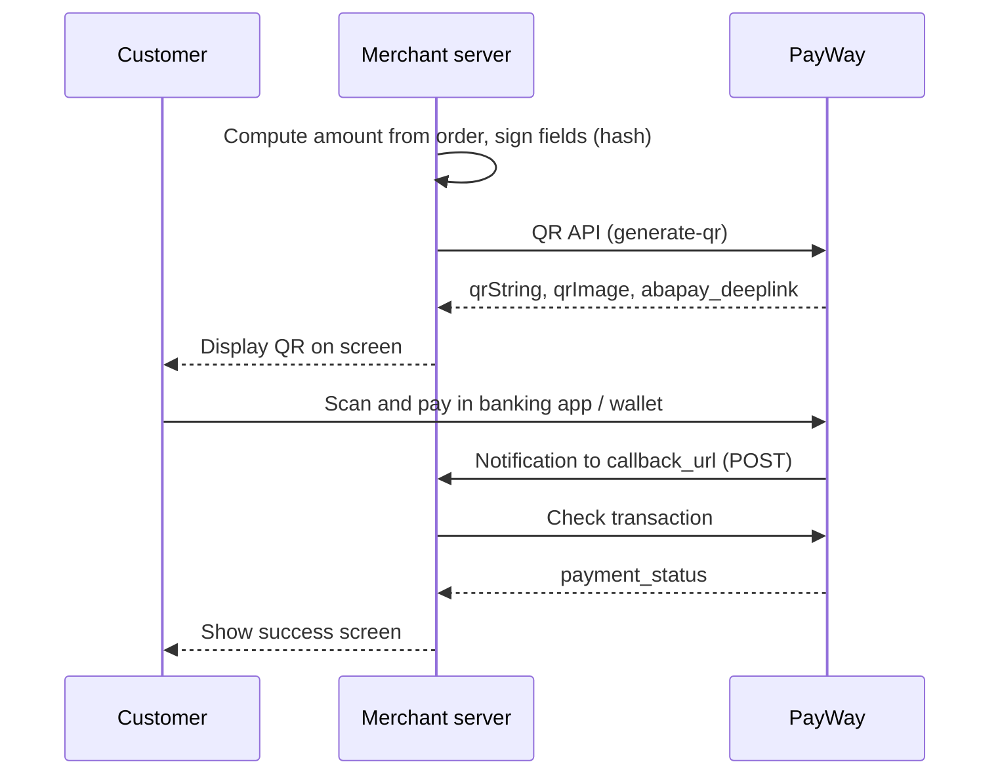

# Dynamic QR

PayWay calls this **ABA QR API**.

## When to use

- Retail counters: show a payment QR on the cashier screen or customer display.
- Self-service kiosks (ticketing, food ordering).
- Unattended devices: parking barriers, vending machines, massage chairs, self laundry.

## When not to use

- The customer pays on your website or in your app → use [Online checkout](online-checkout.md) instead.
- The customer is remote and you send a link by chat, SMS or email → use [Payment link](payment-link.md) instead.

## Flow

## APIs involved

| Step | API |
|---|---|
| 1 | [QR API](../../apis/qr-generate-qr.md) |
| 2 | [Check transaction](../../apis/checkout-check-transaction.md) |

## Sandbox testing

1. Register a sandbox account at <https://sandbox.payway.com.kh/register-sandbox/>; the sandbox merchant ID and API key arrive by email.
2. Ask PayWay to whitelist your server's domain/IP and your `callback_url` domain.
3. Run an example below, generate a QR for a small amount and display it.
   > How to pay a sandbox QR (which test app or wallet to scan with) is not documented on the portal — confirm with PayWay team.
4. Confirm the callback arrives and Check transaction returns `APPROVED`.

## Examples

- [Node.js](../../examples/node/dynamic-qr.md)
- [Python](../../examples/python/dynamic-qr.md)
- [Web (browser)](../../examples/web/dynamic-qr.md)

## Best practices

- Your screens must follow the PayWay QR payment display guidelines (option selection, QR area, success screen) linked from the [portal guide](https://developer.payway.com.kh/aba-qr-api-3158158f0).
- `qrImage` templates can be up to 0.5 MB; on slow networks render `qrString` yourself inside the KHQR frame.
- Use a short `lifetime` (minimum 3 minutes) for counter payments so stale QRs cannot be paid.
- Send your order ID in `return_params` and use it to find the order when the callback arrives; the portal describes the callback `tran_id` as gateway-generated.
- Always confirm with Check transaction; the callback alone is not enough. See also [Security](../../guides/security.md).
