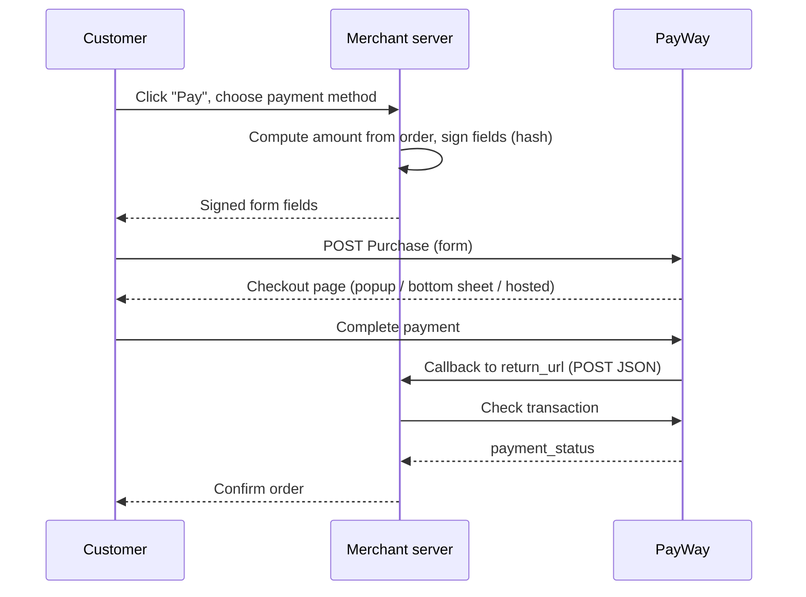

# Online checkout

PayWay calls this **Ecommerce Checkout**.

## When to use

- Online shopping on your website or mobile app.
- Wallet top-ups and digital services.
- On-demand services (food delivery, ride-hailing) and event bookings.

## When not to use

- The customer pays in person at a counter or kiosk → use [Dynamic QR](dynamic-qr.md) instead.
- Selling on Shopify or WooCommerce → use a [PayWay plugin](https://developer.payway.com.kh/plugins-3186291f0) instead.

## Flow

## APIs involved

| Step | API |
|---|---|
| 1 | [Purchase](../../apis/checkout-purchase.md) |
| 2 | [Check transaction](../../apis/checkout-check-transaction.md) |

## Sandbox testing

1. Register a sandbox account at <https://sandbox.payway.com.kh/register-sandbox/>; the sandbox merchant ID and API key arrive by email.
2. Ask PayWay to whitelist your domain/IP (otherwise you get `6: wrong domain`).
3. Run an example below, pay a small amount, and confirm the transaction appears on the sandbox transaction list.
4. Confirm your `return_url` receives the callback and that Check transaction returns `APPROVED`.

## Examples

- [Node.js](../../examples/node/online-checkout.md)
- [Python](../../examples/python/online-checkout.md)
- [Web (browser)](../../examples/web/online-checkout.md)

## Best practices

- Your UI must follow the PayWay eCommerce checkout UI guidelines (payment selection and "We Accept..." area) linked from the [portal guide](https://developer.payway.com.kh/ecommerce-checkout-3158159f0).
- For mobile apps or webviews, send `view_type=hosted` and `return_deeplink` (the portal guide says `hosted`; the Purchase field lists `hosted_view` — confirm with PayWay team).
- Compute and sign the amount on the server. See [Never trust client amounts](../../best-practices/never-trust-client-amounts.md).
- Secure your `return_url`. PayWay signs callbacks with an HMAC-SHA512 header (`X-PayWay-HMAC-SHA512`) over the body values sorted by key; the portal's sample calls the key `YOUR_SECRET_KEY`.
  > Which key signs callbacks is not documented on the portal — confirm with PayWay team.
- Confirm every payment with Check transaction before fulfilling. See also [Security](../../guides/security.md).
