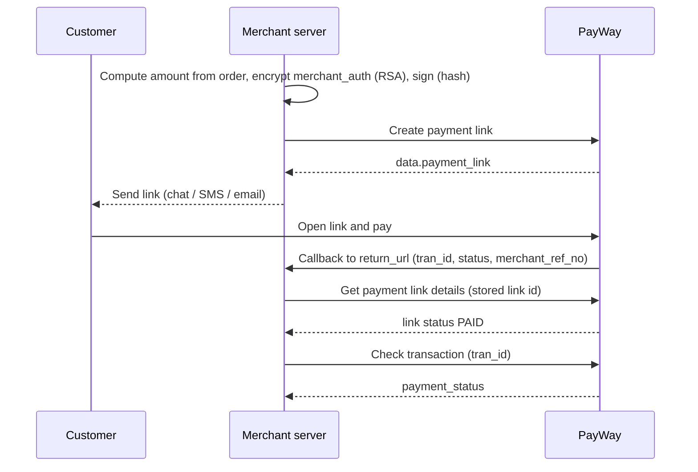

# Payment link

## When to use

- You sell through chat, social media or live streams and today ask buyers to transfer to your bank account.
- You want buyers to pay the exact amount without typing an account number, and your system to be notified automatically.
- You have no website checkout, but your system can call an API.

## When not to use

- The customer pays on your website or in your app → use [Online checkout](online-checkout.md) instead.
- The customer is in front of you at a counter or kiosk → use [Dynamic QR](dynamic-qr.md) instead.
- You only need an occasional link and have no system to integrate: links can also be created manually in the ABA PayWay Merchant Portal or ABA Merchant App (no API needed).

## Flow

## APIs involved

| Step | API |
|---|---|
| 1 | [Create payment link](../../apis/payment-link-create.md) |
| 2 | [Get payment link details](../../apis/payment-link-get-details.md) |
| 3 | [Check transaction](../../apis/checkout-check-transaction.md) |

## Sandbox testing

1. Register a sandbox account at <https://sandbox.payway.com.kh/register-sandbox/>; the sandbox merchant ID and API key arrive by email.
2. Get the RSA public key for `merchant_auth` from PayWay.
   > Whether the sandbox email includes the RSA public key is not documented on the portal — confirm with PayWay team.
3. Run an example below, open the returned `payment_link`, pay a small amount.
4. Confirm your `return_url` receives the callback and Check transaction returns `APPROVED`.

## Examples

- [Node.js](../../examples/node/payment-link.md)
- [Python](../../examples/python/payment-link.md)

## Best practices

- Set `merchant_ref_no` to your own order ID; PayWay returns it in the callback but does not check duplicates, so keep it unique yourself.
- The callback is unauthenticated, and Check transaction does not return the link `id` or `merchant_ref_no`. Before marking an order paid, store the link `id` with the order, confirm that link is `PAID` via Get payment link details, confirm the `tran_id` with Check transaction, and accept each `tran_id` only once.
- Set `payment_limit` to `1` for a single-order link so it becomes `PAID` after one payment.
- Set an `expired_date` so old links cannot be paid after prices change.
- Compute the amount on your server and confirm with Check transaction before shipping. See also [Security](../../guides/security.md).
