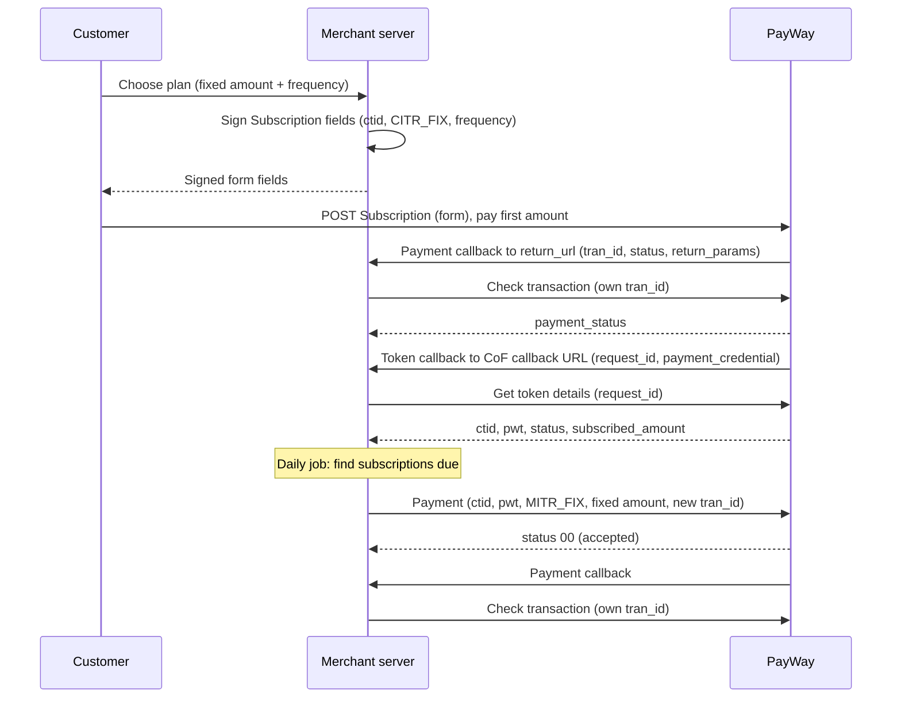

# Recurring

PayWay calls this **Credentials on File**, **Schedule Payment**. The customer subscribes once
(`CITR_FIX`: pays the first amount and gives consent); after that your server charges the same fixed
amount on the agreed schedule (`MITR_FIX`) with no action from the customer.

## When to use

- Subscriptions with a fixed price: internet plans, gym memberships, SaaS or media plans.
- Fixed periodic fees: building maintenance fees, flat-rate utilities, tuition installments.
- The amount **and** the timing are fixed. Supported frequencies: `1W` weekly, `1M` monthly, `2M` every 2 months.

## When not to use

- The amount varies, or you charge on demand (top-ups, usage, one-click checkout) → use [Tokenization](tokenization.md) instead.
- The customer pays once → use [Online checkout](../accept-payments/online-checkout.md) instead.
- You need a different schedule than `1W`, `1M` or `2M` — the portal lists no others. Ask PayWay.

## Flow

## APIs involved

| Step | API |
|---|---|
| 1 | [Subscription](../../apis/cof-subscription.md) |
| 2 | [Check transaction](../../apis/checkout-check-transaction.md) |
| 3 | [Get token details](../../apis/cof-get-token-details.md) |
| 4 | [Payment](../../apis/cof-payment.md) (each scheduled charge, `MITR_FIX`) |

## Sandbox testing

1. Register a sandbox account at <https://sandbox.payway.com.kh/register-sandbox/>; the sandbox merchant ID and API key arrive by email.
2. Ask PayWay to enable Credentials on File and the `CITR_FIX` / `MITR_FIX` flags, and set the Credential on File callback URL under **Outlet Profile > Services > Credential on File**.
   > How to get these enabled in sandbox is not documented on the portal — confirm with PayWay team.
3. Run an example below, post the returned form fields to PayWay and pay the first amount.
4. Confirm both callbacks arrive, Check transaction returns `APPROVED` and Get token details returns `token_flag` `CITR_FIX` with `status` `1`.
5. Trigger the charge job manually and confirm the next payment is `APPROVED`.

## Examples

- [Node.js](../../examples/node/recurring.md)
- [Python](../../examples/python/recurring.md)

## Best practices

- Compute the plan amount on your server; later charges must use the same fixed amount, because `amount_limit_per_tran` is locked to `subscribed_amount`.
- Neither callback is a proof of payment on its own. Confirm each charge with Check transaction using your own `tran_id` and amount, and fetch the token with Get token details rather than trusting the callback body. Only accept a token whose `ctid`, `token_flag`, `frequency` and `subscribed_amount` match the subscription.
- Give every charge its own `tran_id` (for example subscription ID + cycle number) and reserve the cycle before calling PayWay, so a re-run of the job cannot charge the same cycle twice.
- If a callback is missing, query the status with Check transaction so your records stay in sync (the portal's recommended step).
- Build the UI the portal requires: subscribe, view subscription, unsubscribe; follow the [PayWay scheduled-payment UI guidelines](https://www.figma.com/design/ML0Io9zCYnEq6PEZvdEqtJ/AOF---COF-Scheduled-Payments?node-id=4010-5664&t=iIQrPXiqXdyqL3q3-0).
- Expired, frozen or removed tokens are declined; ask the customer to renew in ABA Mobile or your app. See also [Security](../../guides/security.md).
