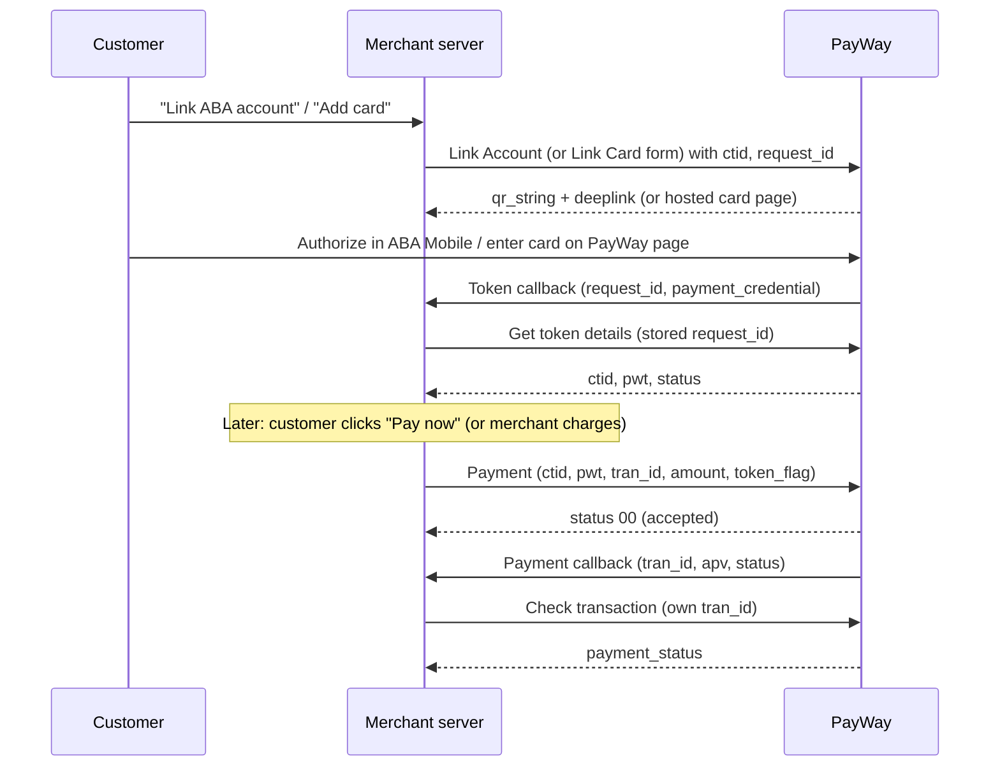

# Tokenization

PayWay calls this **Credentials on File** (CoF), **Unschedule Payment**: payments that happen at any
time, not on a fixed schedule.

## When to use

- One-click checkout: the customer saves an ABA account or card and later pays without scanning a QR
  or re-entering card details (customer-initiated, e.g. ride-hailing, food delivery, wallet top-up).
- You charge variable amounts on demand with the customer's prior consent (merchant-initiated, e.g.
  parking auto-pay, usage overages, no-show fees).

## When not to use

- Fixed amount on a fixed schedule (subscriptions, memberships, tuition installments) → use Recurring
  (PayWay: [Schedule Payment](https://developer.payway.com.kh/schedule-payment-2038907m0)) instead.
- A one-time payment with no saved method → use [Online checkout](../accept-payments/online-checkout.md) instead.

## Flow

## APIs involved

| Step | API |
|---|---|
| 1 | [Link Account](../../apis/cof-link-account.md) or [Link Card](../../apis/cof-link-card.md) |
| 2 | [Get token details](../../apis/cof-get-token-details.md) |
| 3 | [Payment](../../apis/cof-payment.md) |
| 4 | [Check transaction](../../apis/checkout-check-transaction.md) |

The portal also has [Renew Token](https://developer.payway.com.kh/renew-token-19336823e0) and
[Remove token](https://developer.payway.com.kh/remove-token-19336822e0) for managing saved methods.

## Sandbox testing

1. Register a sandbox account at <https://sandbox.payway.com.kh/register-sandbox/>; the sandbox merchant ID and API key arrive by email.
2. Ask PayWay to enable Credentials on File and the token flags you need (`CITI_FLEX`, `CITO_FLEX`) on your sandbox profile; otherwise Link Account returns `104`.
   > How to get these enabled in sandbox is not documented on the portal — confirm with PayWay team.
3. Run an example below, call the link endpoint, scan the QR with ABA Mobile and link an account.
4. Confirm the token callback arrives and Get token details returns `status` `1`, then make a small payment and confirm Check transaction returns `APPROVED`.

## Examples

- [Node.js](../../examples/node/tokenization.md)
- [Python](../../examples/python/tokenization.md)

## Best practices

- The token callback is not signed according to the portal. Store your `request_id` with the customer, and on callback fetch the token with Get token details using that stored `request_id`; only save it when `data.ctid` matches the customer's `ctid`.
- Use one stable, unguessable `ctid` per customer (5–24 letters and digits) and keep the `ctid`/`pwt` pair server-side only.
- Link with `CITO_FLEX` if you will ever charge without the customer present; `CITI_FLEX` tokens only work for customer-initiated payments.
- Treat Payment `00` as "accepted". Mark the order paid only after Check transaction for your own `tran_id` returns `APPROVED` with the order's amount, and mark each order at most once.
- Build the payment-method UI the portal requires (add, view, remove, renew, set default) and follow the [PayWay CoF UI guidelines](https://www.figma.com/design/i6pWxR6XLMBCvh1ihhAnvy/Account---Card-on-File-flows?node-id=0-1&p=f&t=eQFWXjR6h7gCk7ez-0).
- Customers can freeze, renew or remove a token in ABA Mobile; opt in to status callbacks and refresh the token with Get token details when one arrives. See also [Security](../../guides/security.md).
