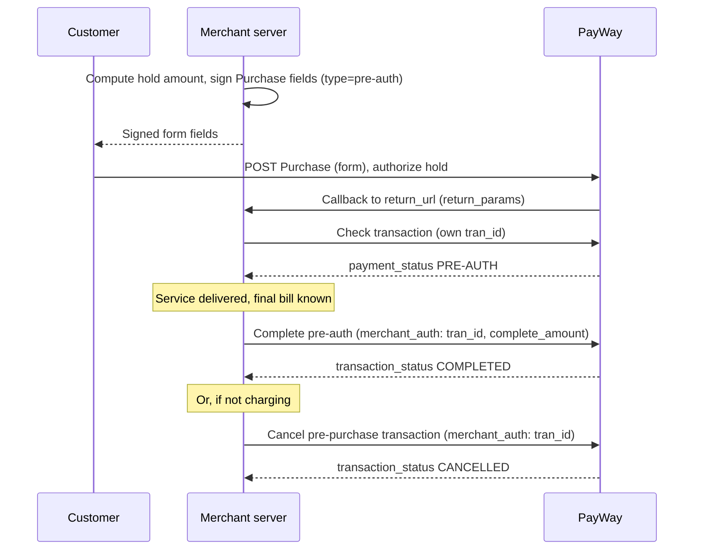

# Pre-auth & capture

PayWay calls this **Pre-auth**: a temporary hold on the customer's funds. The money is reserved but
not deducted; later you **complete** (capture) it or **cancel** (release) it. Think of it as a
security deposit.

## When to use

- The final amount can change before the service ends: hotels, car rentals, gas stations, some online orders.
- You need to confirm the customer has the funds before providing the service.
- You want to hold, settle, and then distribute the money among stakeholders (complete with payout).

## When not to use

- The amount is final at payment time → use [Online checkout](../accept-payments/online-checkout.md) instead.
- You charge a saved method later without a hold → use [Tokenization](../auto-payments/tokenization.md) instead.
- You need to hold funds for more than 30 days: unhandled pre-auths are cancelled automatically after 30 days (default).

## Flow

## APIs involved

| Step | API |
|---|---|
| 1 | [Purchase](../../apis/checkout-purchase.md) with `type` `pre-auth` (ABA PAY, KHQR, cards), or [Payment](../../apis/cof-payment.md) with `purchase_type` `pre-auth` for a saved token |
| 2 | [Check transaction](../../apis/checkout-check-transaction.md) |
| 3a | [Complete pre-auth transactions](../../apis/pre-auth-complete.md) |
| 3b | [Complete pre-auh transaction with payout](../../apis/pre-auth-complete-with-payout.md) |
| 3c | [Cancel pre-purchase transaction](../../apis/pre-auth-cancel.md) |

> The portal's Pre-auth guide links "Purchase using token" to a page (`14530833e0`) that is not in the portal's current page list; the current token [Payment](../../apis/cof-payment.md) API has `purchase_type` `pre-auth`. Confirm with PayWay team which one to use.

## Sandbox testing

1. Register a sandbox account at <https://sandbox.payway.com.kh/register-sandbox/>; the sandbox merchant ID and API key arrive by email.
2. Get the RSA public key for `merchant_auth` from PayWay.
   > Whether the sandbox email includes the RSA public key is not documented on the portal — confirm with PayWay team.
3. Run an example below, post the hold form to PayWay and authorize a small amount.
4. Confirm Check transaction returns `PRE-AUTH`, then complete with a lower amount and confirm `transaction_status` `COMPLETED` — or cancel and confirm `CANCELLED`.

## Examples

- [Node.js](../../examples/node/pre-auth-capture.md)
- [Python](../../examples/python/pre-auth-capture.md)

## Best practices

- Compute both the hold amount and the final amount on your server. Complete only up to the held amount (cards allow up to +10%).
- Don't trust the callback: confirm the hold with Check transaction using your own `tran_id`, requiring `PRE-AUTH` and the held amount, before providing the service.
- Complete and cancel are one-shot and mutually exclusive. Reserve the booking before calling PayWay so a double-click, a retry or a parallel cancel cannot send a second request.
- Track the 30-day limit; complete or cancel before PayWay auto-cancels.
- Note the different hash orders: Complete hashes `merchant_auth`, `request_time`, `merchant_id`; Cancel hashes `merchant_id`, `merchant_auth`, `request_time`. See also [Security](../../guides/security.md).
