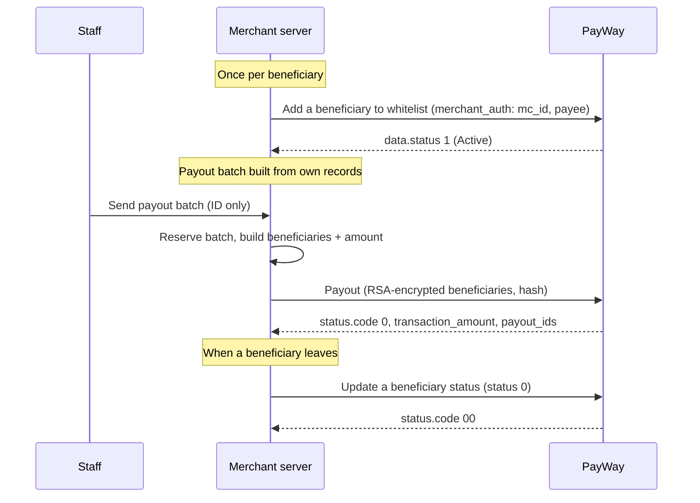

# Beneficiary payout

PayWay calls this **Payout**: distribute funds from your settlement account to recipients. It is
not tied to a customer purchase — you decide when to pay, for example weekly seller earnings,
commissions or partner settlements. Each recipient must first be on your beneficiary list, and must
be an **ABA account holder** (you need their ABA account) or an **ABA merchant** (you need their MID).

## When to use

- You pay sellers, drivers, partners or your own ABA accounts on a schedule or on demand, from money already in your settlement account.
- You need to pay up to 10 beneficiaries in one request.

## When not to use

- You want to split one customer payment at the moment it is paid → use [Split payment](split-payment.md) instead.
- The recipient is not an ABA account holder or ABA merchant: the portal supports only those two.
- You need to refund a customer's purchase → use the portal's [Refund API](https://developer.payway.com.kh/refund-api-14530821e0) instead.

## Flow

## APIs involved

| Step | API |
|---|---|
| 1 | [Add a beneficiary to whitelist](../../apis/payout-add-beneficiary.md) (once per beneficiary) |
| 2 | [Payout](../../apis/payout-payout.md) |
| Any time | [Update a beneficiary status](../../apis/payout-update-beneficiary-status.md) to disable or re-enable a beneficiary |

> No API to look up a payout's status after the fact, and no payout callback, is documented on the portal — confirm with PayWay team.

## Sandbox testing

1. Register a sandbox account at <https://sandbox.payway.com.kh/register-sandbox/>; the sandbox merchant ID and API key arrive by email.
2. Get the RSA public key for `beneficiaries` / `merchant_auth` from PayWay.
   > Whether the sandbox email includes the RSA public key, which sandbox ABA accounts can be whitelisted, and how to fund a sandbox settlement account (code `93`: Insufficient balance) are not documented on the portal — confirm with PayWay team.
3. Whitelist one or two accounts, then run an example below and send a small payout.
4. Confirm the response has `status.code` `"0"` and `transaction_amount` equal to what you sent, then send the same payout again and confirm your server refuses it.

## Examples

- [Node.js](../../examples/node/beneficiary-payout.md)
- [Python](../../examples/python/beneficiary-payout.md)

## Best practices

- Payouts move your money out. Build every beneficiary and amount on your server from your own records; a request from your back office should carry only a payout record ID, never accounts or amounts.
- Use your payout record ID as `tran_id` and send each payout at most once: reserve the record before calling PayWay. PayWay also rejects a reused `tran_id` (codes `4` / `83`).
- Never auto-retry an unclear result (timeout, network error, any non-`0` code) under a new `tran_id`; mark it for review and reconcile first.
- `amount` must equal the sum of the beneficiary amounts (code `92`); work in minor units, and KHR amounts carry no decimals.
- The Payout hash is a **hex** HMAC-SHA512 in the portal's sample, unlike the Base64 hash of every other API here. See [Payout](../../apis/payout-payout.md#authentication-hash).
- Whitelist and disable beneficiaries only from a staff-authorized back office, and disable a beneficiary as soon as you stop paying them. See also [Security](../../guides/security.md).
