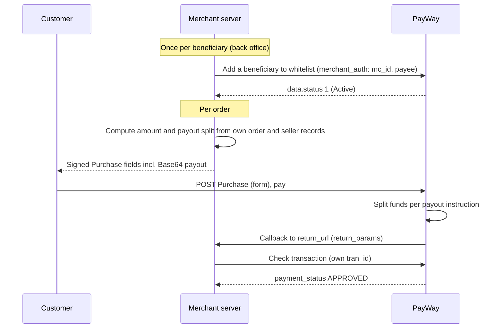

# Split payment

PayWay calls this **Split & Payout**: you collect a purchase and, in the same request, attach a
`payout` instruction that says how the money is distributed to beneficiaries. Every beneficiary
must first be on your whitelist. From the portal, Split & Payout is available for:

1. Checkout
2. Account on File and Card on file
3. Payment Link (API Integration Only)
4. ABA QR API
5. Pre-auth

A beneficiary must be an **ABA account holder** (you need their ABA account) or an **ABA
merchant** (you need their MID).

## When to use

- A marketplace or platform collects one payment and shares it with sellers, drivers or partners.
- You want the split to happen at payment time, without moving money out of your settlement account afterwards.
- Hotel/rental style flows that hold, settle, then distribute ([Pre-auth & capture](../hold-payments/pre-auth-capture.md) with payout).

## When not to use

- You pay people from your settlement balance on demand, not tied to one customer payment → use Beneficiary payout instead.
- All the money stays with you → use [Online checkout](../accept-payments/online-checkout.md) instead.
- The beneficiaries are not ABA account holders or ABA merchants: the portal supports only those two.

## Flow

## APIs involved

| Step | API |
|---|---|
| 1 | [Add a beneficiary to whitelist](../../apis/payout-add-beneficiary.md) (once per beneficiary) |
| 2 | [Purchase](../../apis/checkout-purchase.md) with `payout` — or [QR API](../../apis/qr-generate-qr.md), [Create payment link](../../apis/payment-link-create.md), [Payment](../../apis/cof-payment.md) (token), or [Complete pre-auh transaction with payout](../../apis/pre-auth-complete-with-payout.md) |
| 3 | [Check transaction](../../apis/checkout-check-transaction.md) |
| Any time | [Update a beneficiary status](../../apis/payout-update-beneficiary-status.md) to disable or re-enable a beneficiary |

The `payout` instruction looks different on each API (all from the portal's samples):

| API | `payout` format |
|---|---|
| Purchase, Payment (token) | Base64 JSON, `[{"acc":"000133879","amt":1}]` |
| QR API | Base64 JSON, `[{"account":"201030101","amount":1.72}]` |
| Create payment link | Inside the encrypted `merchant_auth`, `[{"acc":"…","amt":…}]`; total payout must equal the link amount |
| Complete pre-auth with payout | Inside the encrypted `merchant_auth`, `[{"acc":"…","amt":…}]` |

> The portal's guide links Account/Card on File payout to a "Puchase using token" page (`14530833e0`) that is not in the portal's current page list; the current token [Payment](../../apis/cof-payment.md) API has a `payout` field. Confirm with PayWay team which one to use.

## Sandbox testing

1. Register a sandbox account at <https://sandbox.payway.com.kh/register-sandbox/>; the sandbox merchant ID and API key arrive by email.
2. Get the RSA public key for `merchant_auth` from PayWay.
   > Whether the sandbox email includes the RSA public key, and which sandbox ABA accounts can be whitelisted as beneficiaries, is not documented on the portal — confirm with PayWay team.
3. Whitelist each beneficiary account (including your own fee account), then run an example below and pay a small amount.
4. Confirm Check transaction returns `APPROVED` for your `tran_id`, and check each beneficiary's share in the sandbox merchant portal.

## Examples

- [Node.js](../../examples/node/split-payment.md)
- [Python](../../examples/python/split-payment.md)

## Best practices

- Compute the amount **and** every payout account and amount on your server from your own order and seller records. Never accept an account, MID or amount from the browser.
- Make the payouts add up to the full amount: send your own fee to your own whitelisted account. The portal requires this for payment links; for Purchase it is not documented on the portal — confirm with PayWay team.
- Work in minor units (cents, riel) so shares add up exactly; KHR amounts carry no decimals.
- One entry per account (Purchase code `39`: duplicated account) and at most 10 payouts per request (code `25`).
- Card payments cannot be paid out to an ABA account (Purchase code `71`: "Payout for card payment is not allowed to ABA account."). Check which payment options you offer with payout.
- Purchase code `59` reads "Payout info can not be fixed with MID and ABA account", while the Payout API's PHP sample says "You can use mixed MID and Account in beneficiary". Whether one split may mix MIDs and ABA accounts is not documented on the portal — confirm with PayWay team.
- Whitelist and disable beneficiaries only from a staff-authorized back office. Disable a beneficiary as soon as you stop working with them.
- Don't trust the callback: confirm with Check transaction using your own `tran_id`, and mark the order paid once (reserve it before awaiting PayWay). See also [Security](../../guides/security.md).
