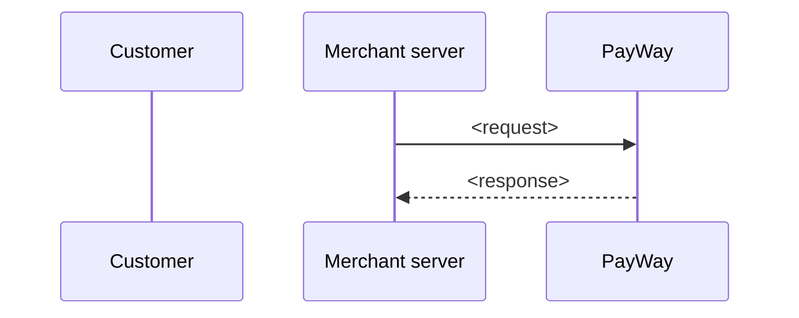

# <Service name>

## When to use

- <Business situation>

## When not to use

- <Situation> → use [<other service>](../<group>/<service>.md) instead.

## Flow

## APIs involved

| Step | API |
|---|---|
| 1 | [<Endpoint>](../../apis/<id>.md) |

## Sandbox testing

1. <Steps to test end-to-end in sandbox.>

## Examples

- [Node.js](../../examples/node/<service>.md)
- [Python](../../examples/python/<service>.md)

## Best practices

- <Service-specific practice.> See also [Security](../../guides/security.md).
